# OMC Documentation

v.1.6.5.2

© 2024, Worth Systems.

---
# 1. Introduction

OMC (Output Management Component) is a central point and the common hub of the communication workflow between third parties software such as:

- **Open Notificatie** (API web service)

- **Open Zaak** (API web service)

- **Open Klant** (API web service)

- **Contactmomenten** (API web service)

- **Notify NL** (API web service)

---
# 2. Architecture

---
# 3. Required environment variables

> NOTE: HOW TO SET THEM...

| Name                                  | Type   | Is sensitive | Validation                                                                                                                                 | Notes                                                                                                                                                                                                                 |
| ------------------------------------- | ------ | ------------ | -------------------------------------------------------------------------------------------------------------------------------------------| --------------------------------------------------------------------------------------------------------------------------------------------------------------------------------------------------------------------- |
| NOTIFY_AUTHORIZATION_JWT_SECRET       | string | true         | Cannot be missing and have null or empty value                                                                                             | For security reasons it should be at least 64 bytes long                                                                                                                                                              |
| NOTIFY_AUTHORIZATION_JWT_ISSUER       | string | true         | Cannot be missing and have null or empty value                                                                                             | Something identifying Notify NL (OMC Web API) service (it will be used internally) - The OMC is issuer                                                                                                                |
| NOTIFY_AUTHORIZATION_JWT_AUDIENCE     | string | true         | Cannot be missing and have null or empty value                                                                                             | Something identifying Notify NL (OMC Web API) service (it will be used internally) - The OMC is audience                                                                                                              |
| NOTIFY_AUTHORIZATION_JWT_EXPIRESINMIN | int    | true         | Cannot be missing and have null or empty value                                                                                             | The OMC JWT tokens are generated by OMC and authorized by Open services. New JWT token has to be generated manually, using OMC dedicated library, if the token validity expire (by default it is 60 minutes)          |
| NOTIFY_AUTHORIZATION_JWT_USERID       | string | false        | Cannot be missing and have null or empty value                                                                                             | The OMC JWT tokens are generated by OMC and authorized by Open services. New JWT token has to be generated manually, using OMC dedicated library, if the token validity expire (by default it is 60 minutes)          |
| NOTIFY_AUTHORIZATION_JWT_USERNAME     | string | false        | Cannot be missing and have null or empty value                                                                                             | The OMC JWT tokens are generated by OMC and authorized by Open services. New JWT token has to be generated manually, using OMC dedicated library, if the token validity expire (by default it is 60 minutes)          |
| ---                                   | ---    | ---          | ---                                                                                                                                        | ---                                                                                                                                                                                                                   |
| NOTIFY_API_BASEURL                    | string | false        | Cannot be missing and have null or empty value                                                                                             | The domain where your Notify API instance is listening (e.g.: "https://api.notifynl.nl")                                                                                                                              |
| ---                                   | ---    | ---          | ---                                                                                                                                        | ---                                                                                                                                                                                                                   |
| USER_AUTHORIZATION_JWT_SECRET         | string | true         | Cannot be missing and have null or empty value                                                                                             | Internal implementation of Open services is regulating this. Better to use something longer as well.                                                                                                                  |
| USER_AUTHORIZATION_JWT_ISSUER         | string | true         | Cannot be missing and have null or empty value                                                                                             | Something identifying OpenZaak / OpenKlant / OpenNotificatie services (token is shared between of them)                                                                                                               |
| USER_AUTHORIZATION_JWT_AUDIENCE       | string | true         | Cannot be missing and have null or empty value                                                                                             | Something identifying Notify NL (OMC Web API) service (it will be used internally) - The OMC is audience                                                                                                              |
| USER_AUTHORIZATION_JWT_EXPIRESINMIN   | int    | true         | Cannot be missing and have null or empty value                                                                                             | This JWT token will be generated from secret, and other JWT claims, configured from Open services web UI, probably OpenZaak? Identical details (secret, iss, aud, exp, etc) as in Open services needs to be used here |
| USER_AUTHORIZATION_JWT_USERID         | string | false        | Cannot be missing and have null or empty value                                                                                             | This JWT token will be generated from secret, and other JWT claims, configured from Open services web UI, probably OpenZaak? Identical details (secret, iss, aud, exp, etc) as in Open services needs to be used here |
| USER_AUTHORIZATION_JWT_USERNAME       | string | false        | Cannot be missing and have null or empty value                                                                                             | This JWT token will be generated from secret, and other JWT claims, configured from Open services web UI, probably OpenZaak? Identical details (secret, iss, aud, exp, etc) as in Open services needs to be used here |
| ---                                   | ---    | ---          | ---                                                                                                                                        | ---                                                                                                                                                                                                                   |
| USER_API_KEY_NOTIFYNL                 | string | true         | Cannot be missing and have null or empty value + must be in UUID format + must pass Notify NL validation                                   | It needs to be generated from Notify Admin Portal                                                                                                                                                                     |
| USER_API_KEY_OBJECTEN                 | string | true         | Cannot be missing and have null or empty value                                                                                             | It needs to be generated from Objecten web UI                                                                                                                                                                         |
| ---                                   | ---    | ---          | ---                                                                                                                                        | ---                                                                                                                                                                                                                   |
| USER_DOMAIN_OPENNOTIFICATIES          | string | false        | Cannot be missing and have null or empty value + only domain should be used: without protocol (http / https) or endpoints (.../api/create) | You have to use the domain part from URLs where you are hosting the dedicated Open services                                                                                                                           |
| USER_DOMAIN_OPENZAAK                  | string | false        | Cannot be missing and have null or empty value + only domain should be used: without protocol (http / https) or endpoints (.../api/create) | You have to use the domain part from URLs where you are hosting the dedicated Open services                                                                                                                           |
| USER_DOMAIN_OPENKLANT                 | string | false        | Cannot be missing and have null or empty value + only domain should be used: without protocol (http / https) or endpoints (.../api/create) | You have to use the domain part from URLs where you are hosting the dedicated Open services                                                                                                                           |
| USER_DOMAIN_OBJECTEN                  | string | false        | Cannot be missing and have null or empty value + only domain should be used: without protocol (http / https) or endpoints (.../api/create) | You have to use the domain part from URLs where you are hosting the dedicated Open services                                                                                                                           |
| USER_DOMAIN_OBJECTTYPEN               | string | false        | Cannot be missing and have null or empty value + only domain should be used: without protocol (http / https) or endpoints (.../api/create) | You have to use the domain part from URLs where you are hosting the dedicated Open services                                                                                                                           |
| ---                                   | ---    | ---          | ---                                                                                                                                        | ---                                                                                                                                                                                                                   |
| USER_TEMPLATEIDS_SMS_ZAAKCREATE       | string | false        | Cannot be missing and have null or empty value + must be in UUID format                                                                    | Should be generated per specific business use case from "NotifyNL" Admin Portal                                                                                                                                         |
| USER_TEMPLATEIDS_SMS_ZAAKUPDATE       | string | false        | Cannot be missing and have null or empty value + must be in UUID format                                                                    | Should be generated per specific business use case from "NotifyNL" Admin Portal                                                                                                                                         |
| USER_TEMPLATEIDS_SMS_ZAAKCLOSE        | string | false        | Cannot be missing and have null or empty value + must be in UUID format                                                                    | Should be generated per specific business use case from "NotifyNL" Admin Portal                                                                                                                                         |
| USER_TEMPLATEIDS_EMAIL_ZAAKCREATE     | string | false        | Cannot be missing and have null or empty value + must be in UUID format                                                                    | Should be generated per specific business use case from "NotifyNL" Admin Portal                                                                                                                                         |
| USER_TEMPLATEIDS_EMAIL_ZAAKUPDATE     | string | false        | Cannot be missing and have null or empty value + must be in UUID format                                                                    | Should be generated per specific business use case from "NotifyNL" Admin Portal                                                                                                                                         |
| USER_TEMPLATEIDS_EMAIL_ZAAKCLOSE      | string | false        | Cannot be missing and have null or empty value + must be in UUID format                                                                    | Should be generated per specific business use case from "NotifyNL" Admin Portal                                                                                                                                         |

---
# 4. Authorization and authentication

---
# 5. Workflow (business logic cases)

---
# 6. Errors

List of **validation** (format, requirements), **connectivity** or business logic **processing** errors that you might encounter during accessing `OMC` API endpoints.

## 6.1. Events Controller

Endpoints:

- POST Listen

## 6.2. Test Controller

### 6.2.1. Notify

Endpoints:

- GET ...Test/HealthCheck
- POST ...Test/SendEmail
- POST ...Test/SendSms

#### 6.2.1.1. Possible errors

##### a) Common for ...Test/SendEmail + ...Test/SendSms:

- Invalid base URL ("NotifyNL" API service):

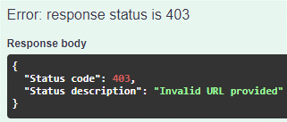

- Invalid format of API key or it is missing ("NotifyNL" API service):

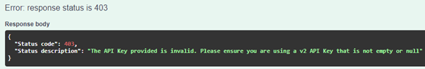

- Invalid API key - it was not registered for this "NotifyNL" API service:

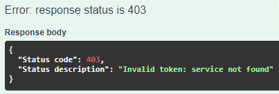

- Template UUID is invalid:

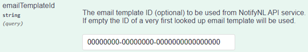
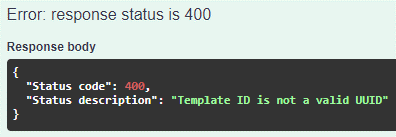

- Template not found:

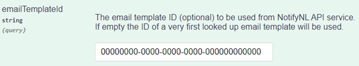

- Missing required personalization (or the default “example” was used):

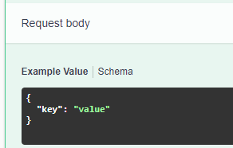
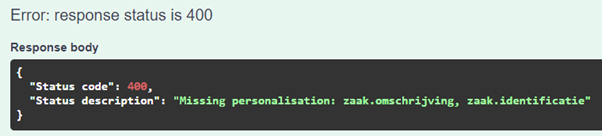

##### b) ...Test/SendEmail:

- Missing required parameters:

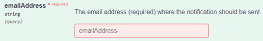
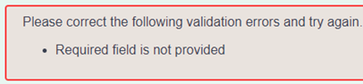

- Email is empty (only whitespaces):

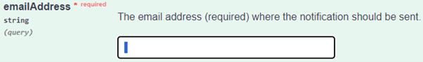
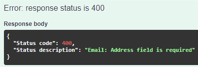

- Email is invalid (missing @, dot, domain, etc.):

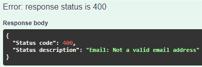

##### c) ...Test/SendSms:

- Missing required parameters:

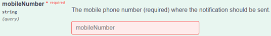

- Phone number is empty (only whitespaces):

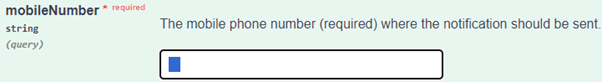

- Phone number contains letters or symbols:

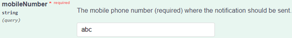
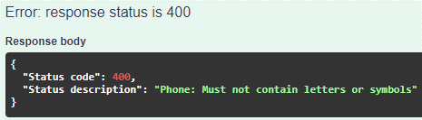

- Phone number contains not enough digits:

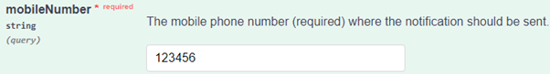
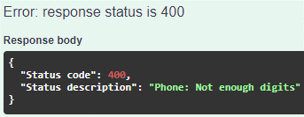

- Phone number contains too many digits:

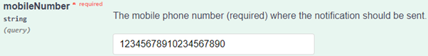

- Phone number has incorrect format (e.g., country code is not supported):

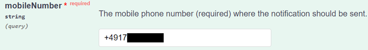
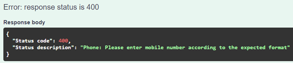