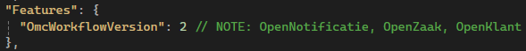

# **OMC** Documentation

v.1.8.4

© 2024, Worth Systems.

---
# 1. Introduction

**OMC (Output Management Component)** is a central point and the common hub of the communication workflow between third parties software such as:

- [**Open Notificaties**](https://github.com/open-zaak/open-notificaties) (Web API service)
- [**Open Zaak**](https://github.com/open-zaak/open-zaak) (Web API service)
- [**Open Klant**](https://github.com/maykinmedia/open-klant) (Web API service)
- [**Objecten**](https://github.com/maykinmedia/objects-api) (Web API service)
- [**ObjectTypen**](https://github.com/maykinmedia/objecttypes-api) (Web API service)
- [**Klantinteracties**](https://vng-realisatie.github.io/klantinteracties/) (Web API service)
- [**Notify NL**](https://github.com/Worth-NL/notifications-api) (Web API service) => based on [**Notify UK**](https://www.notifications.service.gov.uk/)

> **NOTE:** Different versions of these external API services are handled by, so called "[OMC Workflows](#workflow_versions)".

## 1.1. Swagger UI

Since the **OMC** project is just an API, it would not have any user-friendly graphic representation if used as a standalone RESTful ASP.NET Web API project.

That's why **ASP.NET** projects are usually exposing a UI presentation layer for the convenience of future users (usually developers). To achieve this effect, we are using so called [Swagger UI](https://swagger.io/tools/swagger-ui/), a standardized **HTML**/**CSS**/**JavaScript**-based suite of tools and assets made to generate visualized API endpoints, API documentation, data models schema, data validation, interaction with user (API responses), and other helpful hints on how to use the certain API.

**Swagger UI** can be accessed just like a regular webpage, or when you are starting your project in your IDE (preferably **Visual Studio**).


**NOTE**: Check the section dedicated to [requests authorization](#swagger-ui-authorization) when using **Swagger UI**.

### 1.1.1. Using web browser

The URL to **Swagger UI** can be recreated in the following way:

- [Protocol*] + [Domain**] + `/swagger/index.html`

For example: https://omc.acc.notifynl.nl/swagger/index.html

\* Usually https
\** Where your **OMC** Web API application is deployed

### 1.1.2. Using IDE (Visual Studio)

To run the application locally (using **Visual Studio**) select one of the `launchSettings.json` **profiles** to start **Swagger UI** page in your browser (which will be using `/localhost:...` address).

By default these **profiles** are already defined:

- `http`
- `https`
- `IIS Express`

And all of them have **Swagger UI** specified as the default start option.


> **NOTE:** In this example application will start in "Development" mode.

<h4 id="custom-lanunchSettings-profile"> Customizing profile:</h4>

> Full content of `launchSettings.json` file.

```json
{
  "profiles": {
    "http": {
      "commandName": "Project",
      "launchBrowser": true,
      "launchUrl": "swagger",
      "environmentVariables": {
        "ASPNETCORE_ENVIRONMENT": "Development"
      },
      "dotnetRunMessages": true,
      "applicationUrl": "http://localhost:0000"
    },
    "https": {
      "commandName": "Project",
      "launchBrowser": true,
      "launchUrl": "swagger",
      "environmentVariables": {
        "ASPNETCORE_ENVIRONMENT": "Development"
      },
      "dotnetRunMessages": true,
      "applicationUrl": "https://localhost:0001;http://localhost:0000"
    },
    "IIS Express (Development)": {  // NOTE: Name of the profile can be changed
      "commandName": "IISExpress",
      "launchBrowser": true,
      "launchUrl": "swagger",
      "environmentVariables": {
        "ASPNETCORE_ENVIRONMENT": "Development",  // NOTE: Application mode can be changed
		 
        "OMC_AUTHORIZATION_JWT_SECRET": "",
        "OMC_AUTHORIZATION_JWT_ISSUER": "",
        "OMC_AUTHORIZATION_JWT_AUDIENCE": "",
        "OMC_AUTHORIZATION_JWT_EXPIRESINMIN": "",
        "OMC_AUTHORIZATION_JWT_USERID": "OMC (Development)",  // NOTE: Optional place to reflect application mode
        "OMC_AUTHORIZATION_JWT_USERNAME": "OMC (Development)",  // NOTE: Optional place to reflect application mode
        
        "OMC_API_BASEURL_NOTIFYNL": "",
        
        "USER_AUTHORIZATION_JWT_SECRET": "",
        "USER_AUTHORIZATION_JWT_ISSUER": "",
        "USER_AUTHORIZATION_JWT_AUDIENCE": "",
        "USER_AUTHORIZATION_JWT_EXPIRESINMIN": "",
        "USER_AUTHORIZATION_JWT_USERID": "",
        "USER_AUTHORIZATION_JWT_USERNAME": "",
        
        "USER_API_KEY_OPENKLANT_2": "",
        "USER_API_KEY_OBJECTEN": "",
        "USER_API_KEY_OBJECTTYPEN": "",
        "USER_API_KEY_NOTIFYNL": "",
        
        "USER_DOMAIN_OPENNOTIFICATIES": "",
        "USER_DOMAIN_OPENZAAK": "",
        "USER_DOMAIN_OPENKLANT": "",
        "USER_DOMAIN_OBJECTEN": "",
        "USER_DOMAIN_OBJECTTYPEN": "",
        
        "USER_TEMPLATEIDS_EMAIL_ZAAKCREATE": "",
        "USER_TEMPLATEIDS_EMAIL_ZAAKUPDATE": "",
        "USER_TEMPLATEIDS_EMAIL_ZAAKCLOSE": "",
        "USER_TEMPLATEIDS_EMAIL_TASKASSIGNED": "",
        "USER_TEMPLATEIDS_EMAIL_DECISIONMADE": "",
        
        "USER_TEMPLATEIDS_SMS_ZAAKCREATE": "",
        "USER_TEMPLATEIDS_SMS_ZAAKUPDATE": "",
        "USER_TEMPLATEIDS_SMS_ZAAKCLOSE": "",
        "USER_TEMPLATEIDS_SMS_TASKASSIGNED": "",
        "USER_TEMPLATEIDS_SMS_DECISIONMADE": "",

        "USER_WHITELIST_ZAAKCREATE_IDS": "",
        "USER_WHITELIST_ZAAKUPDATE_IDS": "",
        "USER_WHITELIST_ZAAKCLOSE_IDS": "",
        "USER_WHITELIST_TASKASSIGNED_IDS": "",
        "USER_WHITELIST_DECISIONMADE_IDS": "",
        "USER_WHITELIST_MESSAGE_ALLOWED": "false",
        
        "SENTRY_DSN": "",
        "SENTRY_ENVIRONMENT": "Worth Systems (Development)"  // NOTE: Optional place to reflect application instance and mode
      }
    },
    "Docker": {
      "commandName": "Docker",
      "launchBrowser": true,
      "launchUrl": "{Scheme}://{ServiceHost}:{ServicePort}/swagger",
      "publishAllPorts": true,
      "useSSL": true
    }
  },
  "$schema": "https://json.schemastore.org/launchsettings.json",
  "iisSettings": {
    "windowsAuthentication": false,
    "anonymousAuthentication": true,
    "iisExpress": {
      "applicationUrl": "http://localhost:00002",
      "sslPort": 00003
    }
  }
}
```

> **NOTE:** An example of customized "IIS Express (Development)" profile (with environment variables overruling those defined directly in Windows OS).

The developer can create more than one launch profile:
> e.g., for testing **OMC Workflow v1** (pointing to older domains) and **OMC Workflow v2** (pointing to newer domains). Both using different credentials, template IDs, application modes (Production, Development, Test), names, logging identifiers (Sentry.io).


#### Running profile:


## 1.2. Docker

- After cloning **OMC** Git repository:
> git@github.com:Worth-NL/NotifyNL-OMC.git

- Go to the root catalog:
> .../NotifyNL-OMC

- And run the following **docker** command:
> docker build -f EventsHandler/Api/EventsHandler/Dockerfile --force-rm -t `omc` .
>
> **NOTE:** `omc` is just a name of your **docker image** and it can be anything you want.

The command from above is addressing the issue with building **docker image** from the `Dockerfile` location:
`ERROR: failed to solve: failed to compute cache key: failed to calculate checksum of ref`


- From this moment follow the **HELM Chart** documentation to set up _environment variables_
in order to run an already created **docker container**.
 
---
# 2. Architecture

---
# 3. Required environment variables

## 3.1. Different configurations

> **OMC API** and related sub-systems (e.g., **Secrets Manager**) are using mix of configurations:

- `appsettings.json` (for public configurations, which are not meant to vary between customers/instances of OMC)


> NOTE: These configurations are also reflecting the modes which **OMC** Web API application is supporting.

- `environment variables` (for sensitive configurations and/or customizable per customers/instances of **OMC**):

| Name*                                               | Type     | Example                                | Is sensitive | Validation                                                                                                                                 | Notes                                                                                                                                                                                                                 |
| --------------------------------------------------- | -------- | -------------------------------------- | ------------ | ------------------------------------------------------------------------------------------------------------------------------------------ | --------------------------------------------------------------------------------------------------------------------------------------------------------------------------------------------------------------------- |
| **Authorization:** JWT to "OMC" Web API             |          |                                        |              |                                                                                                                                            |                                                                                                                                                                                                                       |
| OMC_AUTHORIZATION_JWT_SECRET                        | string   | "abcd123t2gw3r8192dewEg%wdlsa3e!"      | true         | Cannot be missing and have null or empty value                                                                                             | For security reasons it should be at least 64 bytes long                                                                                                                                                              |
| OMC_AUTHORIZATION_JWT_ISSUER                        | string   | "OMC"                                  | true         | Cannot be missing and have null or empty value                                                                                             | Something identifying Notify NL (OMC Web API) service (it will be used internally) - The OMC is the issuer                                                                                                            |
| OMC_AUTHORIZATION_JWT_AUDIENCE                      | string   | "OMC"                                  | true         | Cannot be missing and have null or empty value                                                                                             | Something identifying Notify NL (OMC Web API) service (it will be used internally) - The OMC is the audience                                                                                                          |
| OMC_AUTHORIZATION_JWT_EXPIRESINMIN                  | ushort   | 60                                     | true         | Cannot be missing and have null or empty value                                                                                             | The OMC JWT tokens are generated by OMC and authorized by Open services. New JWT token has to be generated manually, using OMC dedicated library, if the token validity expire (by default it is 60 minutes)          |
| OMC_AUTHORIZATION_JWT_USERID                        | string   | "tester"                               | false        | Cannot be missing and have null or empty value                                                                                             | The OMC JWT tokens are generated by OMC and authorized by Open services. New JWT token has to be generated manually, using OMC dedicated library, if the token validity expire (by default it is 60 minutes)          |
| OMC_AUTHORIZATION_JWT_USERNAME                      | string   | "Charlotte Sanders"                    | false        | Cannot be missing and have null or empty value                                                                                             | The OMC JWT tokens are generated by OMC and authorized by Open services. New JWT token has to be generated manually, using OMC dedicated library, if the token validity expire (by default it is 60 minutes)          |
| ---                                                 | ---      | ---                                    | ---          | ---                                                                                                                                        | ---                                                                                                                                                                                                                   |
| **Authorization:** JWT to "OpenServices" APIs       |          |                                        |              |                                                                                                                                            |                                                                                                                                                                                                                       |
| USER_AUTHORIZATION_JWT_SECRET                       | string   | "abcd123t2gw3r8192dewEg%wdlsa3e!"      | true         | Cannot be missing and have null or empty value                                                                                             | Internal implementation of Open services is regulating this, however it's better to use something longer as well                                                                                                      |
| USER_AUTHORIZATION_JWT_ISSUER                       | string   | "Open Services"                        | true         | Cannot be missing and have null or empty value                                                                                             | Something identifying OpenZaak / OpenKlant / OpenNotificatie services (token is shared between of them)                                                                                                               |
| USER_AUTHORIZATION_JWT_AUDIENCE                     | string   | "OMC"                                  | true         | Cannot be missing and have null or empty value                                                                                             | Something identifying OMC web API service (it will be used internally) - The OMC is the audience                                                                                                                      |
| USER_AUTHORIZATION_JWT_EXPIRESINMIN                 | ushort   | 60                                     | true         | Cannot be missing and have null or empty value                                                                                             | This JWT token will be generated from secret, and other JWT claims, configured from UI of OpenZaak Web API service. Identical details (secret, iss, aud, exp, etc) as in Open services needs to be used here          |
| USER_AUTHORIZATION_JWT_USERID                       | string   | "admin"                                | false        | Cannot be missing and have null or empty value                                                                                             | This JWT token will be generated from secret, and other JWT claims, configured from UI of OpenZaak Web API service. Identical details (secret, iss, aud, exp, etc) as in Open services needs to be used here          |
| USER_AUTHORIZATION_JWT_USERNAME                     | string   | "Municipality of Rotterdam"            | false        | Cannot be missing and have null or empty value                                                                                             | This JWT token will be generated from secret, and other JWT claims, configured from UI of OpenZaak Web API service. Identical details (secret, iss, aud, exp, etc) as in Open services needs to be used here          |
| ---                                                 | ---      | ---                                    | ---          | ---                                                                                                                                        | ---                                                                                                                                                                                                                   |
| **Authorization:** API Keys                         |          |                                        |              |                                                                                                                                            |                                                                                                                                                                                                                       |
| USER_API_KEY_OPENKLANT_2                            | string   | "43dcba52d312d1e00bc..."               | true         | Cannot be missing and have null or empty value                                                                                             | It needs to be generated from Open Klant 2.0 web UI                                                                                                                                                                   |
| USER_API_KEY_OBJECTEN                               | string   | "56abcd24e75c02d44ee..."               | true         | Cannot be missing and have null or empty value                                                                                             | It needs to be generated from Objecten web UI                                                                                                                                                                         |
| USER_API_KEY_OBJECTTYPEN                            | string   | "647c4eg120f98ed5f5a..."               | true         | Cannot be missing and have null or empty value                                                                                             | It needs to be generated from ObjectTypen web UI                                                                                                                                                                      |
| USER_API_KEY_NOTIFYNL                               | string   | "name-8-4-4-4-12-8-4-4-4-12" (UUID x2) | true         | Cannot be missing and have null or empty value + must be in name-UUID-UUID format + must pass Notify NL validation                         | It needs to be generated from "Notify NL" Admin Portal                                                                                                                                                                |
| ---                                                 | ---      | ---                                    | ---          | ---                                                                                                                                        | ---                                                                                                                                                                                                                   |
| **Connection:** Base URLs to external API services  |          |                                        |              |                                                                                                                                            |                                                                                                                                                                                                                       |
| OMC_API_BASEURL_NOTIFYNL                            | URI      | "https://api.notify.nl"                | false        | Cannot be missing and have null or empty value                                                                                             | The domain where your Notify API instance is listening (e.g.: "https://api.notifynl.nl")                                                                                                                              |
| ---                                                 | ---      | ---                                    | ---          | ---                                                                                                                                        | ---                                                                                                                                                                                                                   |
| **Connection:** Domains of external API services    |          |                                        |              |                                                                                                                                            |                                                                                                                                                                                                                       |
| USER_DOMAIN_OPENNOTIFICATIES                        | string   | "opennotificaties.mycity.nl"           | false        | Cannot be missing and have null or empty value + only domain should be used: without protocol (http / https) or endpoints (.../api/create) | You have to use ONLY the domain part from URLs where you are hosting the dedicated Open services                                                                                                                      |
| USER_DOMAIN_OPENZAAK                                | string   | "openzaak.mycity.nl"                   | false        | Cannot be missing and have null or empty value + only domain should be used: without protocol (http / https) or endpoints (.../api/create) | You have to use ONLY the domain part from URLs where you are hosting the dedicated Open services                                                                                                                      |
| USER_DOMAIN_OPENKLANT                               | string   | "openklant.mycity.nl"                  | false        | Cannot be missing and have null or empty value + only domain should be used: without protocol (http / https) or endpoints (.../api/create) | You have to use ONLY the domain part from URLs where you are hosting the dedicated Open services                                                                                                                      |
| USER_DOMAIN_OBJECTEN                                | string   | "objecten.mycity.nl"                   | false        | Cannot be missing and have null or empty value + only domain should be used: without protocol (http / https) or endpoints (.../api/create) | You have to use ONLY the domain part from URLs where you are hosting the dedicated Open services                                                                                                                      |
| USER_DOMAIN_OBJECTTYPEN                             | string   | "objecttypen.mycity.nl"                | false        | Cannot be missing and have null or empty value + only domain should be used: without protocol (http / https) or endpoints (.../api/create) | You have to use ONLY the domain part from URLs where you are hosting the dedicated Open services                                                                                                                      |
| ---                                                 | ---      | ---                                    | ---          | ---                                                                                                                                        | ---                                                                                                                                                                                                                   |
| **Business:** Templates IDs used by "Notify" API    |          |                                        |              |                                                                                                                                            |                                                                                                                                                                                                                       |
| USER_TEMPLATEIDS_EMAIL_ZAAKCREATE                   | GUID     | "00000000-0000-0000-0000-000000000000" | false        | Cannot be missing and have null or empty value + must be in UUID format                                                                    | Should be generated per specific business use case from "Notify NL" Admin Portal                                                                                                                                      |
| USER_TEMPLATEIDS_EMAIL_ZAAKUPDATE                   | GUID     | "00000000-0000-0000-0000-000000000000" | false        | Cannot be missing and have null or empty value + must be in UUID format                                                                    | Should be generated per specific business use case from "Notify NL" Admin Portal                                                                                                                                      |
| USER_TEMPLATEIDS_EMAIL_ZAAKCLOSE                    | GUID     | "00000000-0000-0000-0000-000000000000" | false        | Cannot be missing and have null or empty value + must be in UUID format                                                                    | Should be generated per specific business use case from "Notify NL" Admin Portal                                                                                                                                      |
| USER_TEMPLATEIDS_EMAIL_TASKASSIGNED                 | GUID     | "00000000-0000-0000-0000-000000000000" | false        | Cannot be missing and have null or empty value + must be in UUID format                                                                    | Should be generated per specific business use case from "Notify NL" Admin Portal                                                                                                                                      |
| USER_TEMPLATEIDS_EMAIL_DECISIONMADE                 | GUID     | "00000000-0000-0000-0000-000000000000" | false        | Cannot be missing and have null or empty value + must be in UUID format                                                                    | Should be generated per specific business use case from "Notify NL" Admin Portal                                                                                                                                      |
| USER_TEMPLATEIDS_SMS_ZAAKCREATE                     | GUID     | "00000000-0000-0000-0000-000000000000" | false        | Cannot be missing and have null or empty value + must be in UUID format                                                                    | Should be generated per specific business use case from "Notify NL" Admin Portal                                                                                                                                      |
| USER_TEMPLATEIDS_SMS_ZAAKUPDATE                     | GUID     | "00000000-0000-0000-0000-000000000000" | false        | Cannot be missing and have null or empty value + must be in UUID format                                                                    | Should be generated per specific business use case from "Notify NL" Admin Portal                                                                                                                                      |
| USER_TEMPLATEIDS_SMS_ZAAKCLOSE                      | GUID     | "00000000-0000-0000-0000-000000000000" | false        | Cannot be missing and have null or empty value + must be in UUID format                                                                    | Should be generated per specific business use case from "Notify NL" Admin Portal                                                                                                                                      |
| USER_TEMPLATEIDS_SMS_TASKASSIGNED                   | GUID     | "00000000-0000-0000-0000-000000000000" | false        | Cannot be missing and have null or empty value + must be in UUID format                                                                    | Should be generated per specific business use case from "Notify NL" Admin Portal                                                                                                                                      |
| USER_TEMPLATEIDS_SMS_DECISIONMADE                   | GUID     | "00000000-0000-0000-0000-000000000000" | false        | Cannot be missing and have null or empty value + must be in UUID format                                                                    | Should be generated per specific business use case from "Notify NL" Admin Portal                                                                                                                                      |
| ---                                                 | ---      | ---                                    | ---          | ---                                                                                                                                        | ---                                                                                                                                                                                                                   |
| **Business:** Whitelisted IDs used by "OMC" Web API |          |                                        |              |                                                                                                                                            |                                                                                                                                                                                                                       |
| USER_WHITELIST_ZAAKCREATE_IDS                       | string[] | "1, 2, 3, 4"                           | false        |                                                                                                                                            | Is provided by the user based on "Identificatie" property of case type in OpenZaak Web API service                                                                                                                    |
| USER_WHITELIST_ZAAKUPDATE_IDS                       | string[] | "1, 2, 3, 4"                           | false        |                                                                                                                                            | Is provided by the user based on "Identificatie" property of case type in OpenZaak Web API service                                                                                                                    |
| USER_WHITELIST_ZAAKCLOSE_IDS                        | string[] | "1, 2, 3, 4"                           | false        |                                                                                                                                            | Is provided by the user based on "Identificatie" property of case type in OpenZaak Web API service                                                                                                                    |
| USER_WHITELIST_TASKASSIGNED_IDS                     | string[] | "1, 2, 3, 4"                           | false        |                                                                                                                                            | Is provided by the user based on "Identificatie" property of case type in OpenZaak Web API service                                                                                                                    |
| USER_WHITELIST_DECISIONMADE_IDS                     | string[] | "1, 2, 3, 4"                           | false        |                                                                                                                                            | Is provided by the user based on "Identificatie" property of case type in OpenZaak Web API service                                                                                                                    |
| USER_WHITELIST_MESSAGE_ALLOWED                      | bool     | true / false                           | false        | Cannot be missing and have null or empty value                                                                                             | Is provided by the user                                                                                                                                                                                               |
| ---                                                 | ---      | ---                                    | ---          | ---                                                                                                                                        | ---                                                                                                                                                                                                                   |
| **Monitoring:** Configurations used by "Sentry"     |          |                                        |              |                                                                                                                                            |                                                                                                                                                                                                                       |
| SENTRY_DSN                                          | URI      | "https://1abxxx@o1xxx.sentry.io/xxx"   | false        | Validated internally by Sentry.SDK                                                                                                         | It points out to the Sentry project configured to store captured events from the app (messages, exceptions)                                                                                                           |
| SENTRY_ENVIRONMENT                                  | string   | "MyCompany-prod"                       | false        | Validated internally by Sentry.SDK                                                                                                         | It's the identifier used by Sentry external logging system to distinguish instance and mode of the application (it can contains name of the company, or specific environment: prod, acc, dev, test...)                |

\* Copy-paste the *environment variable* name and set the value of respective type like showed in the **Example** column from the above.

**NOTE**: All of the configurations are required and validated whether they are null or empty. If you need to skip some `envionment variable` just use a value containing an empty space `" "`.

### 3.1.1. How to get some of these environment variables

`OMC_AUTHORIZATION_JWT_SECRET` - To be generated from any passwords manager. Like other **OMC_AUTHORIZATION_[...]** configurations it's meant to be set by the user.

`USER_AUTHORIZATION_JWT_SECRET` - Like other **USER_AUTHORIZATION_[...]** configurations to be configured and set by the user after logging to **OpenZaak** Web API service.

`USER_API_KEY_NOTIFYNL` - To be generated from **NotifyNL** Admin Portal => **API Integration** section.

`USER_TEMPLATEIDS_SMS_ZAAKCREATE` - All **Template IDs** (SMS and Email) will be generated (and then you can copy-paste them into environment variables) when the user create (one-by-one) new templates from **NotifyNL** Admin Portal => **Templates** section.

## 3.2. Setting environment variables

1. On Windows:


Additionally, environment variables can be also defined in **Visual Studio**'s `launchSettings.json` file. Check the example [here](#custom-lanunchSettings-profile).

2. On Linux:

> To be finished...

3. On Mac:

> To be finished...

## 3.3. Using HELM Charts

**NotifyNL** and **OMC** are meant to be used with [HELM Charts](https://helm.sh/) (helping to install them on your machine).

- [NotifyNL HELM Charts (GitHub)](https://github.com/Worth-NL/helm-charts)

- [OMC HELM Charts (GitHub)](https://github.com/Worth-NL/helm-charts/tree/main/notifynl-omc)

---
# 4. Authorization and authentication

All of the API services involved in the notifying process (**OpenServices**, **OMC**, **Notify**) requires some type of authorization and authentication procedure.

> **NOTE:** some external Web API services (e.g. **Open Klant** v2.0 or **Objecten** APIs) are using prefedined _API keys_ to authenticate users and authorize them to access the service. In other cases, JWT have to be generated (and refreshed if needed).

> The user of **OMC** doesn't have to worry which authorization method will be used behind the hood, as long as you provide valid credentials and specify which version of "OpenServices" [workflow](#workflow_versions) is used.

## 4.1. JSON Web Tokens

In the normal business workflow **OMC** API will ensure that valid _JWT tokens_ would be used internally (based on the provided credentials (_environment variables_). However, developers testing or maintaining the solution need to generate their own JWT tokens (e.g., to access the **OMC** API endpoints from **Swagger UI** or **Postman**) using one of the following approaches.

**JSON Web Token (JWT)** can be generated using:

- **SecretsManager.exe** from `CLI (Command Line Interface)` externally (e.g., `CMD.exe on Windows`, using valid credentials defined in _environment variables_)

> The commands are defined in the [Secrets Manager](https://github.com/Worth-NL/NotifyNL-OMC/blob/update/Documentation/EventsHandler/Logic/SecretsManager/Readme.md)'s documentation.
> **NOTE:** Do not use `PowerShell`.

An example of a simple `.cmd` script using one of the commands responsible for creating _JWT token_ valid for 24 hours:

<code>
"C:\[...]\NotifyNL-OMC\EventsHandler\Logic\SecretsManager\bin\Debug\net7.0\NotifyNL.SecretsManager.exe" 1440

pause
</code>

Users can also execute their commands directly in the catalog where **SecretsManager.exe** is located.

- **SecretsManager.dll** (after referencing and importing the library) from the code (using valid credentials defined in _environment variables_ or overruled from launch profile in _launchSettings.json_)

> To learn more, read the documentation dedicated to [Secrets Manager](https://github.com/Worth-NL/NotifyNL-OMC/blob/update/Documentation/EventsHandler/Logic/SecretsManager/Readme.md).

- By running **Secrets Manager** project in _Visual Studio_ (after selecting "Set as Startup Project" option in Solution Explorer and using valid credentials defined in _environment variables_ or overruled from launch profile in _launchSettings.json_)


- Through the external **https://jwt.io** webpage (using the same credentials as those defined in _environment variables_).

### 4.1.1. Required JSON Web Token (JWT) components

> Knowing all required *environment variables* you can fill these claims manually and generate your own JWT tokens without using **Secrets Manager**. This approach might be helpful if you are using **OMC** Web API service only as a Web API service (**Swagger UI**), during testing its functionality from **Postman**, or when using only the **Docker Image**.

#### 4.1.1.1. Header (algorithm + type)

> {
  "alg": "HS256",
  "typ": "JWT"
}

#### 4.1.1.2. Payload (claims)

> {
  "client_id": "",
  "user_id": "",
  "user_representation": "",
  "iss": "",
  "aud": "",
  "iat": 0000000000,
  "exp": 0000000000
}

#### 4.1.1.3. Signature (secret)


> **NOTE:** To be filled in **https://jwt.io**.

### 4.1.2. Mapping of JWT claims from environment variables

| JWT claims            | **OMC** Environment Variables                |
| --------------------- | ---------------------------------------- |
| `client_id`           | `OMC_AUTHORIZATION_JWT_ISSUER`           |
| `user_id`             | `OMC_AUTHORIZATION_JWT_USERID`           |
| `user_representation` | `OMC_AUTHORIZATION_JWT_USERNAME`         |
| `iss`                 | `OMC_AUTHORIZATION_JWT_ISSUER`           |
| `aud`                 | `OMC_AUTHORIZATION_JWT_AUDIENCE`         |
| `iat`                 | To be filled manually using current time |
| `exp`                 | `OMC_AUTHORIZATION_JWT_EXPIRESINMIN`     |
| `secret`              | `OMC_AUTHORIZATION_JWT_SECRET`           |

> **NOTE:** "iat" and "exp" times requires Unix formats of timestamps.
The Unix timestamp can be generated using [Unix converter](https://www.unixtimestamp.com/).

### 4.1.3. Using generated JSON Web Token (JWT)

#### 4.1.3.1. Postman

> After generating the JWT token you can copy-paste it in **Postman** to authorize your HTTP requests.


---
<h4 id="swagger-ui-authorization">4.1.3.2. Swagger UI</h3>

> If you are using **OMC** **Swagger UI** from browser (graphic interface for **OMC** Web API service) then you need to copy the generated token in the following way:


And then click "Authorize".

---
# 5. OMC Workflow


> Version of **OMC** <= 1.7.4 (using "[OMC workflow v1](#workflow_dependencies)").

<h2 id="workflow_versions">5.1. Versions of OMC workflows</h3>

The **OMC** API is using different configurations and setups to handle multiple complex business cases. Sometimes, it is even required to support multiple versions of the same external API services (which might be very different from each other).

<code>**Last update:** 24 Jun 2024</code>

<h3 id="workflow_dependencies">5.1.1. Dependencies</h3>

Here are the details which _workflows_ are using which versions of the external API services:

#### OMC workflow v1 `(default)`:
- "OpenNotificaties" v1.6.0
- "OpenZaak" v1.12.1
- "OpenKlant" v1.0.0
- "Objecten" v2.3.1
- "ObjectTypen" v2.2.0
- "Contactmomenten" v1.0.0

#### OMC workflow v2:
- "OpenNotificaties" v1.6.0
- "OpenZaak" v1.12.1
- <code>new</code> "OpenKlant" v2.0.0
- "Objecten" v2.3.1
- "ObjectTypen" v2.2.0
- <code>new</code> "Klantcontacten" v2.0.0

> **NOTE:** The OMC workflows can be defined in `appsettings[...].json` configuration file.

### 5.1.2. Default workflows

By default `appsettings.json` (fallback), `appsettings.Production.json`, and `appsettings.Test.json` are using the older version of the **OMC workflow**, while `appsettings.Development.json` is using the most recent one.

### 5.1.3. Customization

To change the **OMC workflow** you just have to change the value of `Features:OmcWorkflowVersion` in `appsettings[...].json` to one of the supported ones:

- 1
- 2



> **NOTE:** These numbers are just reflecting the currently supported workflows => e.g., `v1`, `v2`.

You can also determine which _appsettings[...].json_ configuration will be used by setting a respective value of `ASPNETCORE_ENVIRONMENT` property in `environmentVariables` in your _launch profile_ defined in `launchSettings.json`. The supported values are:

- "Production"
- "Development"
- "Test"


During the start of the **OMC** application the content of `appsettings.[ASPNETCORE_ENVIRONMENT].json` file will be loaded.

> **NOTE:** Sometimes, in the documentation or in the code, when referring to this value a name "application mode(s)" might be used - because this _environment variable_ is usually defining the global setup / behavior of any **.NET** application.

## 5.2. Initial notifications

Any **OMC** workflow relies on receiving the (initial) notification from **Notificaties** API service to trigger the processing business logic. This notification is in _JSON_ format and can be also passed from outside to HTTP Requests while using **Swagger UI** or **Postman** - to simulate the desired **OMC** behavior.

### 5.2.1. Scenarios

Currently, the following business **scenarios** are implemented:

- Opening the _case_
- Updating the _case_ status
- Closing the _case_
- Assignment of the _task_
- Receiving the _decision_

### 5.2.2. Examples of notifications

These are the examples of the structure of _JSON payloads_ to be used as initial notifications for testing or development purposes:

#### 5.2.2.1. Cases

```json
{
  "actie": "create",
  "kanaal": "zaken",
  "resource": "status",
  "kenmerken": {
    "zaaktype": "https://...",
    "bronorganisatie": "000000000",
    "vertrouwelijkheidaanduiding": "openbaar" // Or "vertrouwelijk"
  },
  "hoofdObject": "https://...",
  "resourceUrl": "https://...",
  "aanmaakdatum": "2000-01-01T10:00:00.000Z"
}
```

#### 5.2.2.2. Tasks

```json
{
  "actie": "create",
  "kanaal": "objecten",
  "resource": "object",
  "kenmerken": {
    "objectType": "https://..."
  },
  "hoofdObject": "https://...",
  "resourceUrl": "https://...",
  "aanmaakdatum": "2000-01-01T10:00:00.000Z"
}
```

#### 5.2.2.3. Decisions

```json
{
  "actie": "create",
  "kanaal": "besluiten",
  "resource": "besluit",
  "kenmerken": {
    "besluittype": "https://...",
    "verantwoordelijkeOrganisatie": "000000000"
  },
  "hoofdObject": "https://...",
  "resourceUrl": "https://...",
  "aanmaakdatum": "2000-01-01T10:00:00.000Z"
}
```

---
# 6. Errors

List of **validation** (format, requirements), **connectivity** or business logic **processing** errors that you might encounter during accessing **OMC** API endpoints.

**General errors:**

> **HTTP Status Code: 401 Unauthorized**

- Invalid JWT token:


- Invalid JWT secret:


## 6.1. Events Controller

Endpoints:

- `POST` .../Events/Listen
- `GET` .../Events/Version

#### 6.1.2. Possible errors

> HTTP Status Code: 206 Partial Content

- Test notification received:


**NOTE**: Open Notificaties API is sending test notifications to ensure whether **OMC** is able to receive incoming notifications.

- Not implemented scenario:


> HTTP Status Code: 422 Unprocessable Entity

- Invalid JSON payload (syntax error):


- Invalid data model (missing required fields):


**NOTE:** Multiple propertis are supported (comma-separated).

- Invalid data model (unexpected fields):


**NOTE:** Multiple propertis are supported (comma-separated).

> HTTP Status Code: 500 Internal Server Error

Any eventual (however unlike) unhandled exceptions will be reported as 500.

> HTTP Status Code: 501 Not Implemented

Other cases (than not implemented business case scenarios) may raise 501 errors.
This is however highly unlikely and might occur mainly in the development phase.

---
## 6.2. Notify Controller

Endpoints:

- `POST` .../Notify/Confirm

#### 6.2.1. Possible errors

> HTTP Status Code: 400 Bad Request

- HTTP Request error


Something went wrong when calling external API services: OpenZaak, OpenKlant, contactmomenten...

You woull get the following outcome (separated by pipes):
`OMC` | `Log severity (Error / Warning / Info / Debug)` | `The first possible error message`* | `Full URL to which request was tried to be send` | `The original JSON response from the called service`** | `Notification: The initial notification`

\*  That interrupted the happy path workflow due to connectivity issues, invalid configuration values, or service being down. Unfortunately, due to complexity of the system, the variety of potential errors is quite broad.

\** **WARNING**: For some mysterious reasons, authors of the third-party software (used in **OMC-NotifyNL** workflow) decided to communicate back with the user of their API (Application **Public** Interface - through **publicly** accessible **World Wide Web** network) by using one of the local languages. You might need to translate those received _JSON Response_ messages into English.

> **NOTE**: Unfortunately, **OMC** Development Team cannot provide meaningful guidance how the external services were developed or configured.

---
## 6.3. Test Controller

### 6.3.1. Testing Notify

Endpoints:

- `GET` .../Test/Notify/HealthCheck
- `POST` .../Test/Notify/SendEmail
- `POST` .../Test/Notify/SendSms

#### 6.3.1.1. Possible errors

##### a) Common for SendEmail + SendSms:

> **HTTP Status Code: 403 Forbidden**

- Invalid base URL (**NotifyNL** API service):


- Invalid format of API key or it is missing (**NotifyNL** API service):


- Invalid API key - it was not registered for this **NotifyNL** API service:


> **HTTP Status Code: 400 Bad Request**

- Template UUID is invalid:


- Template not found:


- Missing required personalization (or the default “example” was used):


##### b) SendEmail:

- Missing required parameters:


> **HTTP Status Code: 400 Bad Request**

- Email is empty (only whitespaces):


- Email is invalid (missing @, dot, domain, etc.):


##### c) SendSms:

- Missing required parameters:


> **HTTP Status Code: 400 Bad Request**

- Phone number is empty (only whitespaces):


- Phone number contains letters or symbols:


- Phone number contains not enough digits:


- Phone number contains too many digits:


- Phone number has incorrect format (e.g., country code is not supported):


### 6.3.2. Testing Open services

Endpoints:

- `POST` .../Test/Open/ContactRegistration

#### 6.3.2.1. Possible errors

> To be finished...