# **OMC** Documentation

v.1.11.3

© 2024, Worth Systems.

---
# 1. Introduction

**OMC (Output Management Component)** is a central point and the common hub of the communication workflow between third parties software such as:

<h4 id="openServices-list"> Open services (repositories):</h4>

- [**Open Notificaties**](https://github.com/open-zaak/open-notificaties) (Web API service)
- [**Open Zaak**](https://github.com/open-zaak/open-zaak) (Web API service)
- [**Open Klant**](https://github.com/maykinmedia/open-klant) (Web API service)
- [**Besluiten**](https://github.com/open-zaak/open-zaak) (Web API service)  `NOTE: It's part of Open Zaak repository`
- [**Objecten**](https://github.com/maykinmedia/objects-api) (Web API service)
- [**ObjectTypen**](https://github.com/maykinmedia/objecttypes-api) (Web API service)
- [**Klantinteracties**](https://vng-realisatie.github.io/klantinteracties/) (Web API service)

<h4 id="notify-list"> Notify:</h4>

- [**Notify NL**](https://github.com/Worth-NL/notifications-api) (Web API service) => based on [**Notify UK**](https://www.notifications.service.gov.uk/)
    
    \- Web API service (Python)

    \- Language-specific clients (e.g., C#, JavaScript, PHP)
    > **OMC** is written in C# and using .NET Client for Notify.

    \- Webpage: admin portal

> **NOTE:** Different versions of these external API services are handled by, so-called "[OMC Workflows](#workflow_versions)".

## 1.1. Swagger UI

Since the **OMC** project is just an API, it would not have any user-friendly graphic representation if used as a standalone RESTful ASP.NET Web API project.

That's why **ASP.NET** projects are usually exposing a UI presentation layer for the convenience of future users (usually developers). To achieve this effect, we are using so called [Swagger UI](https://swagger.io/tools/swagger-ui/), a standardized **HTML**/**CSS**/**JavaScript**-based suite of tools and assets made to generate visualized API endpoints, API documentation, data models schema, data validation, interaction with user (API responses), and other helpful hints on how to use the certain API.

**Swagger UI** can be accessed just like a regular webpage, or when you are starting your project in your IDE (preferably **Visual Studio**).

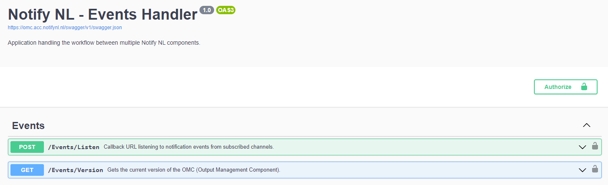

**NOTE**: Check the section dedicated to [requests authorization](#swagger-ui-authorization) when using **Swagger UI**.

### 1.1.1. Using web browser

The URL to **Swagger UI** can be recreated in the following way:

- [Protocol*] + [Domain**] + `/swagger/index.html`

For example: https://omc.acc.notifynl.nl/swagger/index.html

\* Usually https
\** Where your **OMC** Web API application is deployed

### 1.1.2. Using IDE (Visual Studio)

To run the application locally (using **Visual Studio**) select one of the `launchSettings.json` **profiles** to start **Swagger UI** page in your browser (which will be using `/localhost:...` address).

By default these **profiles** are already defined:

- `http`
- `https`
- `IIS Express`

And all of them have **Swagger UI** specified as the default start option.

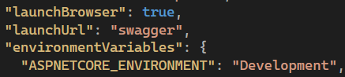

> **NOTE:** In this example application will start in "Development" mode.

<h4 id="custom-lanunchSettings-profile"> Customizing profile:</h4>

> Full content of `launchSettings.json` file.

```json
{
  "profiles": {
    "http": {
      "commandName": "Project",
      "launchBrowser": true,
      "launchUrl": "swagger",
      "environmentVariables": {
        "ASPNETCORE_ENVIRONMENT": "Development"
      },
      "dotnetRunMessages": true,
      "applicationUrl": "http://localhost:0000"
    },
    "https": {
      "commandName": "Project",
      "launchBrowser": true,
      "launchUrl": "swagger",
      "environmentVariables": {
        "ASPNETCORE_ENVIRONMENT": "Development"
      },
      "dotnetRunMessages": true,
      "applicationUrl": "https://localhost:0001;http://localhost:0000"
    },
    "IIS Express (Development)": {  // NOTE: Name of the profile can be changed
      "commandName": "IISExpress",
      "launchBrowser": true,
      "launchUrl": "swagger",
      "environmentVariables": {
        "ASPNETCORE_ENVIRONMENT": "Development",  // NOTE: Application mode can be changed
		 
        "OMC_AUTHORIZATION_JWT_SECRET": "",
        "OMC_AUTHORIZATION_JWT_ISSUER": "",
        "OMC_AUTHORIZATION_JWT_AUDIENCE": "",
        "OMC_AUTHORIZATION_JWT_EXPIRESINMIN": "",
        "OMC_AUTHORIZATION_JWT_USERID": "OMC (Development)",  // NOTE: Optional place to reflect application mode
        "OMC_AUTHORIZATION_JWT_USERNAME": "OMC (Development)",  // NOTE: Optional place to reflect application mode
        
        "OMC_API_BASEURL_NOTIFYNL": "",

        "OMC_FEATURES_WORKFLOW_VERSION": "",
        
        "USER_AUTHORIZATION_JWT_SECRET": "",
        "USER_AUTHORIZATION_JWT_ISSUER": "",
        "USER_AUTHORIZATION_JWT_AUDIENCE": "",
        "USER_AUTHORIZATION_JWT_EXPIRESINMIN": "",
        "USER_AUTHORIZATION_JWT_USERID": "",
        "USER_AUTHORIZATION_JWT_USERNAME": "",
        
        "USER_API_KEY_OPENKLANT": "", // NOTE: Not required if OMC Workflow v1 is used
        "USER_API_KEY_OBJECTEN": "",
        "USER_API_KEY_OBJECTTYPEN": "",
        "USER_API_KEY_NOTIFYNL": "",
        
        "USER_DOMAIN_OPENNOTIFICATIES": "",
        "USER_DOMAIN_OPENZAAK": "",
        "USER_DOMAIN_OPENKLANT": "",
        "USER_DOMAIN_OBJECTEN": "",
        "USER_DOMAIN_OBJECTTYPEN": "",
        "USER_DOMAIN_CONTACTMOMENTEN": "",
        
        "USER_TEMPLATEIDS_EMAIL_ZAAKCREATE": "",
        "USER_TEMPLATEIDS_EMAIL_ZAAKUPDATE": "",
        "USER_TEMPLATEIDS_EMAIL_ZAAKCLOSE": "",
        "USER_TEMPLATEIDS_EMAIL_TASKASSIGNED": "",
        "USER_TEMPLATEIDS_EMAIL_MESSAGERECEIVED": "",
        
        "USER_TEMPLATEIDS_SMS_ZAAKCREATE": "",
        "USER_TEMPLATEIDS_SMS_ZAAKUPDATE": "",
        "USER_TEMPLATEIDS_SMS_ZAAKCLOSE": "",
        "USER_TEMPLATEIDS_SMS_TASKASSIGNED": "",
        "USER_TEMPLATEIDS_SMS_MESSAGERECEIVED": "",

        "USER_TEMPLATEIDS_DECISIONMADE": "",

        "USER_WHITELIST_ZAAKCREATE_IDS": "",
        "USER_WHITELIST_ZAAKUPDATE_IDS": "",
        "USER_WHITELIST_ZAAKCLOSE_IDS": "",
        "USER_WHITELIST_TASKASSIGNED_IDS": "",
        "USER_WHITELIST_DECISIONMADE_IDS": "",
        "USER_WHITELIST_MESSAGE_ALLOWED": "false",
        "USER_WHITELIST_TASKOBJECTTYPE_UUID": "",
        "USER_WHITELIST_MESSAGEOBJECTTYPE_UUID": "",
        "USER_WHITELIST_DECISIONINFOOBJECTTYPE_UUIDS": "",

        "USER_VARIABLES_OBJECTEN_MESSAGEOBJECTTYPE_VERSION" : "",
        
        "SENTRY_DSN": "",
        "SENTRY_ENVIRONMENT": "Worth Systems (Development)"  // NOTE: Optional place to reflect application instance and mode
      }
    },
    "Docker": {
      "commandName": "Docker",
      "launchBrowser": true,
      "launchUrl": "{Scheme}://{ServiceHost}:{ServicePort}/swagger",
      "publishAllPorts": true,
      "useSSL": true
    }
  },
  "$schema": "https://json.schemastore.org/launchsettings.json",
  "iisSettings": {
    "windowsAuthentication": false,
    "anonymousAuthentication": true,
    "iisExpress": {
      "applicationUrl": "http://localhost:00002",
      "sslPort": 00003
    }
  }
}
```

> **NOTE:** An example of customized "IIS Express (Development)" profile (with environment variables overruling those defined directly in Windows OS).

The developer can create more than one launch profile:
> e.g., for testing **OMC Workflow v1** (pointing to older domains) and **OMC Workflow vXYZ** (pointing to newer domains). Both using different credentials, template IDs, application modes (_Production_, _Development_, _Test_), names, logging identifiers (Sentry.io), etc.


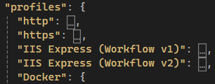

#### Running profile:


## 1.2. Docker

- After cloning **OMC** Git repository:
> git@github.com:Worth-NL/NotifyNL-OMC.git

- Go to the root catalog:
> .../NotifyNL-OMC

- And run the following **docker** command:
> docker build -f EventsHandler/Api/EventsHandler/Dockerfile --force-rm -t `omc` .
>
> **NOTE:** `omc` is just a name of your **docker image** and it can be anything you want.

The command from above is addressing the issue with building **docker image** from the `Dockerfile` location:
`ERROR: failed to solve: failed to compute cache key: failed to calculate checksum of ref`

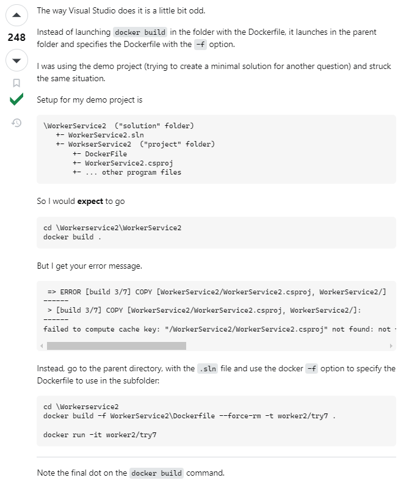

- From this moment follow the **HELM Chart** documentation to set up _environment variables_
in order to run an already created **docker container**.
 
---
# 2. Architecture

[Scenarios](#scenarios) implemented in **OMC** are following _Strategy Design Pattern_, and they are using JSON data deserialized into _POCO (Plain Old CLR Object)_ models, and passed as _DTO (Data Transfer Object)_ models to query services (reflecting the external micro-services architecture of third-party "Open Services"). Query services are aggregated under _IQueryContext_ and its implementation _QueryContext_ - following _Adapter Design Pattern_ thanks to which queries can be agnostic (dependencies resolved internally) and organized within a single testable abstraction, giving the developers access to all available API query methods.

---
# 3. Required environment variables

## 3.1. Different configurations

**OMC API** and related sub-systems (e.g., **Secrets Manager**) are using two types of configurations:

> - public (`appsettings.json`)
> - private (`environment variables`)

Which can also be divided into other two categories:

> - universal settings (not changing very often; basic/default behavior of **OMC**)
> - customizable settings (which may vary between **OMC** instances; business)

Easier to monitor, test, modify, and maintain by developers are `appsettings.json`,
but `environment variables` are easier to be adjusted by the end users of **OMC**.

### 3.1.1. `appsettings.json`

> Made for public configurations (can be preserved in the code). They are not meant to be changed very often.

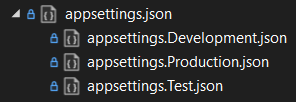

> **NOTE:** Here are defined settings related to HTTP connection, encryption used for JWT tokens to authorize HTTP requests to / from other Web API services, or default variables defining **OMC** domain setup - adjusting how the generic and agnostic [**Open Services**](#openServices-list) will be utilized.

<h4 id="appsettings-content"> Settings:</h4>

> Full content of `appsettings.json` file.

```JSON
{
  "Logging": {
    "LogLevel": {
      "Default": "Information",
      "Microsoft.AspNetCore": "Information"
    }
  },
  "Network": {
    "ConnectionLifetimeInSeconds": 90,
    "HttpRequestTimeoutInSeconds": 60,
    "HttpRequestsSimultaneousNumber": 20
  },
  "Encryption": {
    "IsAsymmetric": false
  },

  // Predefined variables based on which the application workflow currently relies.
  // NOTE: Their default values should not be changed, unless they are also adopted on
  //       the OpenZaak and OpenKlant API sides (which are more dynamic than OMC API).
  "Variables": {
    // ENG: Subject type (e.g., person or organization)
    "BetrokkeneType": "natuurlijk_persoon",
    // ENG: General description => "initiator role"
    "OmschrijvingGeneriek": "initiator",
    // ENG: Party identifier => e.g., "citizen identifier"
    "PartijIdentificator": "Burgerservicenummer",
    // ENG: Email general description (e.g., "email", "e-mail", "Email"...)
    "EmailOmschrijvingGeneriek": "Email",
    // ENG: Phone general description (e.g., "phone", "mobile", "nummer"...)
    "TelefoonOmschrijvingGeneriek": "Telefoon",

    "OpenKlant": {
      "CodeObjectType": "Zaak",
      "CodeRegister": "ZRC",
      "CodeObjectTypeId": "identificatie"
    },

    // User communication: Messages to be put into register exposed to citizens
    "UxMessages": {
      "SMS_Success_Subject": "Notificatie verzonden",
      "SMS_Success_Body": "SMS notificatie succesvol verzonden.",

      "SMS_Failure_Subject": "We konden uw notificatie niet afleveren.",
      "SMS_Failure_Body": "Het afleveren van een SMS bericht is niet gelukt. Controleer het telefoonnumer in uw profiel.",

      "Email_Success_Subject": "Notificatie verzonden",
      "Email_Success_Body": "E-mail notificatie succesvol verzonden.",

      "Email_Failure_Subject": "We konden uw notificatie niet afleveren.",
      "Email_Failure_Body": "Het afleveren van een email bericht is niet gelukt. Controleer het emailadres in uw profiel."
    }
  },
  "AllowedHosts": "*"
}
```

You can determine which _appsettings[...].json_ configuration will be used by setting a respective value of `ASPNETCORE_ENVIRONMENT` property in `environmentVariables` in your _launch profile_ defined in `launchSettings.json`. The supported values are:

- "Production"
- "Development"
- "Test"

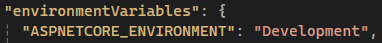

During the start of the **OMC** application the content of `appsettings.[ASPNETCORE_ENVIRONMENT].json` file will be loaded.

> **NOTE:** Sometimes, in the documentation or in the code, when referring to this value a name "application mode(s)" might be used - because this _environment variable_ is usually defining the global setup / behavior of any **.NET** application.

### 3.1.2. `environment variables`

> Meant to store sensitive configurations and / or customizable per instances of the **OMC** application).

**Required variables:**

| Name*                                               | .NET Type | Example                                       | Is sensitive | Validation                                                                                                                                 | Notes                                                                                                                                                                                                                 |
| --------------------------------------------------- | --------- | --------------------------------------------- | ------------ | ------------------------------------------------------------------------------------------------------------------------------------------ | --------------------------------------------------------------------------------------------------------------------------------------------------------------------------------------------------------------------- |
| **Authorization:** JWT to "OMC" Web API             |           |                                               |              |                                                                                                                                            |                                                                                                                                                                                                                       |
| OMC_AUTHORIZATION_JWT_SECRET                        | string    | "abcd123t2gw3r8192dewEg%wdlsa3e!"             | true         | Cannot be missing and have null or empty value                                                                                             | For security reasons it should be at least 64 bytes long                                                                                                                                                              |
| OMC_AUTHORIZATION_JWT_ISSUER                        | string    | "OMC"                                         | true         | Cannot be missing and have null or empty value                                                                                             | Something identifying Notify NL (OMC Web API) service (it will be used internally) - The OMC is the issuer                                                                                                            |
| OMC_AUTHORIZATION_JWT_AUDIENCE                      | string    | "OMC"                                         | true         | Cannot be missing                                                                                                                          | Something identifying Notify NL (OMC Web API) service (it will be used internally) - The OMC is the audience                                                                                                          |
| OMC_AUTHORIZATION_JWT_EXPIRESINMIN                  | ushort    | "60"                                          | true         | Cannot be missing and have null or empty value                                                                                             | The OMC JWT tokens are generated by OMC and authorized by Open services. New JWT token has to be generated manually, using OMC dedicated library, if the token validity expire (by default it is 60 minutes)          |
| OMC_AUTHORIZATION_JWT_USERID                        | string    | "tester"                                      | false        | Cannot be missing and have null or empty value                                                                                             | The OMC JWT tokens are generated by OMC and authorized by Open services. New JWT token has to be generated manually, using OMC dedicated library, if the token validity expire (by default it is 60 minutes)          |
| OMC_AUTHORIZATION_JWT_USERNAME                      | string    | "Charlotte Sanders"                           | false        | Cannot be missing and have null or empty value                                                                                             | The OMC JWT tokens are generated by OMC and authorized by Open services. New JWT token has to be generated manually, using OMC dedicated library, if the token validity expire (by default it is 60 minutes)          |
| ---                                                 | ---       | ---                                           | ---          | ---                                                                                                                                        | ---                                                                                                                                                                                                                   |
| **Connection:** Base URLs to external API services  |           |                                               |              |                                                                                                                                            |                                                                                                                                                                                                                       |
| OMC_API_BASEURL_NOTIFYNL                            | URI       | "https://api.notify.nl"                       | false        | Cannot be missing and have null or empty value                                                                                             | The domain where your Notify API instance is listening (e.g.: "https://api.notifynl.nl")                                                                                                                              |
| ---                                                 | ---       | ---                                           | ---          | ---                                                                                                                                        | ---                                                                                                                                                                                                                   |
| **Features:** of the "OMC" Web API                  |           |                                               |              |                                                                                                                                            |                                                                                                                                                                                                                       |
| OMC_FEATURES_WORKFLOW_VERSION                       | byte      | "1"                                           | false        | Cannot be missing and have null or empty value. It also needs to correspond to already supported [OMC Workflows](#workflow_versions)       | The list of supported OMC workflows can be found [here](#workflow_dependencies)                                                                                                                                       |
| ---                                                 | ---       | ---                                           | ---          | ---                                                                                                                                        | ---                                                                                                                                                                                                                   |
| **Authorization:** JWT to "OpenServices" APIs       |           |                                               |              |                                                                                                                                            |                                                                                                                                                                                                                       |
| USER_AUTHORIZATION_JWT_SECRET                       | string    | "abcd123t2gw3r8192dewEg%wdlsa3e!"             | true         | Cannot be missing and have null or empty value                                                                                             | Internal implementation of Open services is regulating this, however it's better to use something longer as well                                                                                                      |
| USER_AUTHORIZATION_JWT_ISSUER                       | string    | "Open Services"                               | true         | Cannot be missing and have null or empty value                                                                                             | Something identifying "OpenZaak" / "OpenKlant" / "OpenNotificatie" Web API services (token is shared between of them)                                                                                                 |
| USER_AUTHORIZATION_JWT_AUDIENCE                     | string    | "OMC"                                         | true         | Cannot be missing                                                                                                                          | Something identifying OMC Web API service (it will be used internally) - The OMC is the audience                                                                                                                      |
| USER_AUTHORIZATION_JWT_EXPIRESINMIN                 | ushort    | "60"                                          | true         | Cannot be missing and have null or empty value                                                                                             | This JWT token will be generated from secret, and other JWT claims, configured from UI of OpenZaak Web API service. Identical details (secret, iss, aud, exp, etc) as in Open services needs to be used here          |
| USER_AUTHORIZATION_JWT_USERID                       | string    | "admin"                                       | false        | Cannot be missing and have null or empty value                                                                                             | This JWT token will be generated from secret, and other JWT claims, configured from UI of OpenZaak Web API service. Identical details (secret, iss, aud, exp, etc) as in Open services needs to be used here          |
| USER_AUTHORIZATION_JWT_USERNAME                     | string    | "Municipality of Rotterdam"                   | false        | Cannot be missing and have null or empty value                                                                                             | This JWT token will be generated from secret, and other JWT claims, configured from UI of OpenZaak Web API service. Identical details (secret, iss, aud, exp, etc) as in Open services needs to be used here          |
| ---                                                 | ---       | ---                                           | ---          | ---                                                                                                                                        | ---                                                                                                                                                                                                                   |
| **Authorization:** API Keys                         |           |                                               |              |                                                                                                                                            |                                                                                                                                                                                                                       |
| USER_API_KEY_OPENKLANT                              | string    | "43dcba52d312d1e00bc..."                      | true         | Cannot be missing and have null or empty value (if you are using OMC Workflow v2 and above; otherwise, it's not mandatory)                 | It needs to be generated for OMC Workflow v2 and above from "OpenKlant" 2.0 Web API service UI                                                                                                                        |
| USER_API_KEY_OBJECTEN                               | string    | "56abcd24e75c02d44ee..."                      | true         | Cannot be missing and have null or empty value                                                                                             | It needs to be generated from "Objecten" Web API service UI                                                                                                                                                           |
| USER_API_KEY_OBJECTTYPEN                            | string    | "647c4eg120f98ed5f5a..."                      | true         | Cannot be missing and have null or empty value                                                                                             | It needs to be generated from "ObjectTypen" Web API service UI                                                                                                                                                        |
| USER_API_KEY_NOTIFYNL                               | string    | "name-8-4-4-4-12-8-4-4-4-12" (ID + UUID x2)   | true         | Cannot be missing and have null or empty value + must be in name-UUID-UUID format + must pass Notify NL validation                         | It needs to be generated from "Notify NL" Admin Portal                                                                                                                                                                |
| ---                                                 | ---       | ---                                           | ---          | ---                                                                                                                                        | ---                                                                                                                                                                                                                   |
| **Connection:** Domains of external API services    |           |                                               |              |                                                                                                                                            |                                                                                                                                                                                                                       |
| USER_DOMAIN_OPENNOTIFICATIES                        | string    | "opennotificaties.mycity.nl/api/v1"           | false        | Cannot be missing and have null or empty value + only domain should be used: without protocol (http / https). Without slash at the end     | You have to use the domain part from URLs where you are hosting the dedicated Open services                                                                                                                      |
| USER_DOMAIN_OPENZAAK                                | string    | "openzaak.mycity.nl/zaken/api/v1"             | false        | Cannot be missing and have null or empty value + only domain should be used: without protocol (http / https). Without slash at the end     | You have to use the domain part from URLs where you are hosting the dedicated Open services                                                                                                                      |
| USER_DOMAIN_OPENKLANT                               | string    | "openklant.mycity.nl/klanten/api/v1"          | false        | Cannot be missing and have null or empty value + only domain should be used: without protocol (http / https). Without slash at the end     | You have to use the domain part from URLs where you are hosting the dedicated Open services                                                                                                                      |
| USER_DOMAIN_BESLUITEN                               | string    | "besluiten.mycity.nl/besluiten/api/v1"        | false        | Cannot be missing and have null or empty value + only domain should be used: without protocol (http / https). Without slash at the end     | You have to use the domain part from URLs where you are hosting the dedicated Open services                                                                                                                      |
| USER_DOMAIN_OBJECTEN                                | string    | "objecten.mycity.nl/api/v2"                   | false        | Cannot be missing and have null or empty value + only domain should be used: without protocol (http / https). Without slash at the end     | You have to use the domain part from URLs where you are hosting the dedicated Open services                                                                                                                      |
| USER_DOMAIN_OBJECTTYPEN                             | string    | "objecttypen.mycity.nl/api/v2"                | false        | Cannot be missing and have null or empty value + only domain should be used: without protocol (http / https). Without slash at the end     | You have to use the domain part from URLs where you are hosting the dedicated Open services                                                                                                                      |
| USER_DOMAIN_CONTACTMOMENTEN                         | string    | "openklant.mycity.nl/contactmomenten/api/v1"  | false        | Cannot be missing and have null or empty value + only domain should be used: without protocol (http / https). Without slash at the end     | You have to use the domain part from URLs where you are hosting the dedicated Open services                                                                                                                      |
| ---                                                 | ---       | ---                                           | ---          | ---                                                                                                                                        | ---                                                                                                                                                                                                                   |
| **Business:** Templates IDs used by "Notify" API    |           |                                               |              |                                                                                                                                            |                                                                                                                                                                                                                       |
| USER_TEMPLATEIDS_EMAIL_ZAAKCREATE                   | GUID**    | "00000000-0000-0000-0000-000000000000"        | false        | Cannot be missing and have null or empty value + must be in UUID format                                                                    | Should be generated per specific business use case from "Notify NL" Admin Portal                                                                                                                                      |
| USER_TEMPLATEIDS_EMAIL_ZAAKUPDATE                   | GUID      | "00000000-0000-0000-0000-000000000000"        | false        | Cannot be missing and have null or empty value + must be in UUID format                                                                    | Should be generated per specific business use case from "Notify NL" Admin Portal                                                                                                                                      |
| USER_TEMPLATEIDS_EMAIL_ZAAKCLOSE                    | GUID      | "00000000-0000-0000-0000-000000000000"        | false        | Cannot be missing and have null or empty value + must be in UUID format                                                                    | Should be generated per specific business use case from "Notify NL" Admin Portal                                                                                                                                      |
| USER_TEMPLATEIDS_EMAIL_TASKASSIGNED                 | GUID      | "00000000-0000-0000-0000-000000000000"        | false        | Cannot be missing and have null or empty value + must be in UUID format                                                                    | Should be generated per specific business use case from "Notify NL" Admin Portal                                                                                                                                      |
| USER_TEMPLATEIDS_EMAIL_MESSAGE                      | GUID      | "00000000-0000-0000-0000-000000000000"        | false        | Cannot be missing and have null or empty value + must be in UUID format                                                                    | Should be generated per specific business use case from "Notify NL" Admin Portal                                                                                                                                      |
| USER_TEMPLATEIDS_SMS_ZAAKCREATE                     | GUID      | "00000000-0000-0000-0000-000000000000"        | false        | Cannot be missing and have null or empty value + must be in UUID format                                                                    | Should be generated per specific business use case from "Notify NL" Admin Portal                                                                                                                                      |
| USER_TEMPLATEIDS_SMS_ZAAKUPDATE                     | GUID      | "00000000-0000-0000-0000-000000000000"        | false        | Cannot be missing and have null or empty value + must be in UUID format                                                                    | Should be generated per specific business use case from "Notify NL" Admin Portal                                                                                                                                      |
| USER_TEMPLATEIDS_SMS_ZAAKCLOSE                      | GUID      | "00000000-0000-0000-0000-000000000000"        | false        | Cannot be missing and have null or empty value + must be in UUID format                                                                    | Should be generated per specific business use case from "Notify NL" Admin Portal                                                                                                                                      |
| USER_TEMPLATEIDS_SMS_TASKASSIGNED                   | GUID      | "00000000-0000-0000-0000-000000000000"        | false        | Cannot be missing and have null or empty value + must be in UUID format                                                                    | Should be generated per specific business use case from "Notify NL" Admin Portal                                                                                                                                      |
| USER_TEMPLATEIDS_SMS_MESSAGE                        | GUID      | "00000000-0000-0000-0000-000000000000"        | false        | Cannot be missing and have null or empty value + must be in UUID format                                                                    | Should be generated per specific business use case from "Notify NL" Admin Portal                                                                                                                                      |
| USER_TEMPLATEIDS_DECISIONMADE                       | GUID      | "00000000-0000-0000-0000-000000000000"        | false        | Cannot be missing and have null or empty value + must be in UUID format                                                                    | Should be generated per specific business use case from "Notify NL" Admin Portal                                                                                                                                      |
| ---                                                 | ---       | ---                                           | ---          | ---                                                                                                                                        | ---                                                                                                                                                                                                                   |
| **Business:** Whitelisted IDs used by "OMC" Web API |           |                                               |              |                                                                                                                                            |                                                                                                                                                                                                                       |
| USER_WHITELIST_ZAAKCREATE_IDS                       | string[]  | "1, 2, 3, 4" or "*" (allow everything)        | false        |                                                                                                                                            | Is provided by the user based on "Identificatie" property of case type retrieved from case URI ("zaak") from "OpenZaak" Web API service                                                                               |
| USER_WHITELIST_ZAAKUPDATE_IDS                       | string[]  | "1, 2, 3, 4" or "*" (allow everything)        | false        |                                                                                                                                            | Is provided by the user based on "Identificatie" property of case type retrieved from case URI ("zaak") from "OpenZaak" Web API service                                                                               |
| USER_WHITELIST_ZAAKCLOSE_IDS                        | string[]  | "1, 2, 3, 4" or "*" (allow everything)        | false        |                                                                                                                                            | Is provided by the user based on "Identificatie" property of case type retrieved from case URI ("zaak") from "OpenZaak" Web API service                                                                               |
| USER_WHITELIST_TASKASSIGNED_IDS                     | string[]  | "1, 2, 3, 4" or "*" (allow everything)        | false        |                                                                                                                                            | Is provided by the user based on "Identificatie" property of case type retrieved from case URI ("zaak") from "OpenZaak" Web API service                                                                               |
| USER_WHITELIST_DECISIONMADE_IDS                     | string[]  | "1, 2, 3, 4" or "*" (allow everything)        | false        |                                                                                                                                            | Is provided by the user based on "Identificatie" property of case type retrieved from case URI ("zaak") from "OpenZaak" Web API service                                                                               |
| USER_WHITELIST_MESSAGE_ALLOWED                      | bool      | "true" or "false"                             | false        | Cannot be missing and have null or empty value                                                                                             | Is provided by the user                                                                                                                                                                                               |
| USER_WHITELIST_TASKOBJECTTYPE_UUID                  | GUID      | "00000000-0000-0000-0000-000000000000"        | false        | Cannot be missing and have null or empty value + must be in UUID format                                                                    | Is provided by the user based on "objectType" from "kenmerken" from the initial notification received from "Notificaties" Web API service                                                                             |
| USER_WHITELIST_MESSAGEOBJECTTYPE_UUID               | GUID      | "00000000-0000-0000-0000-000000000000"        | false        | Cannot be missing and have null or empty value + must be in UUID format                                                                    | Is provided by the user based on "objectType" from "kenmerken" from the initial notification received from "Notificaties" Web API service                                                                             |
| USER_WHITELIST_DECISIONINFOOBJECTTYPE_UUIDS         | GUID[]    | "00000000-0000-..., 00000000-0000-..."        | false        | Cannot be missing and have null or empty value + must be in UUID format                                                                    | Is provided by the user based on "informatieobjecttype" from "informatieobject" retrieved from "OpenZaak" Web API service when querying "besluiten"                                                                   |
| ---                                                 | ---       | ---                                           | ---          | ---                                                                                                                                        | ---                                                                                                                                                                                                                   |
| **Variables:** Used by "OMC" Web API                |           |                                               |              |                                                                                                                                            |                                                                                                                                                                                                                       |
| USER_VARIABLES_OBJECTEN_MESSAGEOBJECTTYPE_VERSION   | ushort    | "1"                                           | false        | Cannot be missing and have null or empty value                                                                                             | It can be taken from "version" value set in "ObjectTypen" Web API service                                                                                                                                             |
| ---                                                 | ---       | ---                                           | ---          | ---                                                                                                                                        | ---                                                                                                                                                                                                                   |
| **Monitoring:** Configurations used by "Sentry"     |           |                                               |              |                                                                                                                                            |                                                                                                                                                                                                                       |
| SENTRY_DSN                                          | URI       | "https://1abxxx@o1xxx.sentry.io/xxx"          | false        | Validated internally by Sentry.SDK                                                                                                         | It points out to the Sentry project configured to store captured events from the app (messages, exceptions)                                                                                                           |
| SENTRY_ENVIRONMENT                                  | string    | "MyCompany-prod"                              | false        | Validated internally by Sentry.SDK                                                                                                         | It's the identifier used by Sentry external logging system to distinguish instance and mode of the application (it can contains name of the company, or specific environment: prod, acc, dev, test...)                |

\* Copy-paste the *environment variable* name and set the value of respective type like showed in the **Example** column from the above.
\** GUID and UUID are representing the same data type in the following format: 8-4-4-4-12 and using Hexadecimal values (0-f). The difference is that UUID is used in cross-platform context, while GUID is the data type used in .NET

#### 3.1.2.1. How to get some of these environment variables

`OMC_AUTHORIZATION_JWT_SECRET` - To be generated from any passwords manager. Like other **OMC_AUTHORIZATION_[...]** configurations it's meant to be set by the user.

`USER_AUTHORIZATION_JWT_SECRET` - Like other **USER_AUTHORIZATION_[...]** configurations to be configured and set by the user after logging to **OpenZaak** Web API service.

`USER_API_KEY_NOTIFYNL` - To be generated from **NotifyNL** Admin Portal => **API Integration** section.

`USER_TEMPLATEIDS_SMS_ZAAKCREATE` - All **Template IDs** (SMS and Email) will be generated (and then you can copy-paste them into environment variables) when the user create (one-by-one) new templates from **NotifyNL** Admin Portal => **Templates** section.

#### 3.1.2.2. Setting environment variables

1. On Windows:

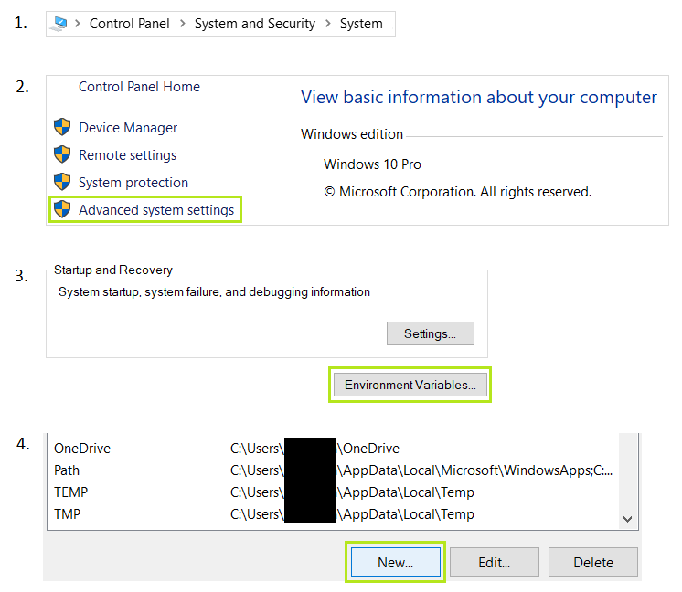

Additionally, environment variables can be also defined in **Visual Studio**'s `launchSettings.json` file. Check the example [here](#custom-lanunchSettings-profile).

2. On Linux:

> To be finished...

3. On Mac:

> To be finished...

#### 3.1.2.3. Using HELM Charts

**NotifyNL** and **OMC** are meant to be used with [HELM Charts](https://helm.sh/) (helping to install them on your local machine / server).

- [NotifyNL HELM Charts (GitHub)](https://github.com/Worth-NL/helm-charts)

- [OMC HELM Charts (GitHub)](https://github.com/Worth-NL/helm-charts/tree/main/notifynl-omc)

---
# 4. Authorization and authentication

All of the API services involved in the notifying process (**OpenServices**, **OMC**, **Notify**) requires some type of authorization and authentication procedure.

> **NOTE:** some external Web API services (e.g. **Open Klant** v2.0 or **Objecten** APIs) are using prefedined _API keys_ to authenticate users and authorize them to access the service. In other cases, JWT have to be generated (and refreshed if needed).

> The user of **OMC** doesn't have to worry which authorization method will be used behind the hood, as long as you provide valid credentials and specify which version of "OpenServices" [workflow](#workflow_versions) is used.

## 4.1. JSON Web Tokens

In the normal business workflow **OMC** API will ensure that valid _JWT tokens_ would be used internally (based on the provided credentials (_environment variables_). However, developers testing or maintaining the solution need to generate their own JWT tokens (e.g., to access the **OMC** API endpoints from **Swagger UI** or **Postman**) using one of the following approaches.

**JSON Web Token (JWT)** can be generated using:

- **SecretsManager.exe** from `CLI (Command Line Interface)` externally (e.g., `CMD.exe on Windows`, using valid credentials defined in _environment variables_)

> The commands are defined in the [Secrets Manager](https://github.com/Worth-NL/NotifyNL-OMC/blob/update/Documentation/EventsHandler/Logic/SecretsManager/Readme.md)'s documentation.
> **NOTE:** Do not use `PowerShell`.

An example of a simple `.cmd` script using one of the commands responsible for creating _JWT token_ valid for 24 hours:

<code>
"C:\[...]\NotifyNL-OMC\EventsHandler\Logic\SecretsManager\bin\Debug\net7.0\NotifyNL.SecretsManager.exe" 1440

pause
</code>

Users can also execute their commands directly in the catalog where **SecretsManager.exe** is located.

- **SecretsManager.dll** (after referencing and importing the library) from the code (using valid credentials defined in _environment variables_ or overruled from launch profile in _launchSettings.json_)

> To learn more, read the documentation dedicated to [Secrets Manager](https://github.com/Worth-NL/NotifyNL-OMC/blob/update/Documentation/EventsHandler/Logic/SecretsManager/Readme.md).

- By running **Secrets Manager** project in _Visual Studio_ (after selecting "Set as Startup Project" option in Solution Explorer and using valid credentials defined in _environment variables_ or overruled from launch profile in _launchSettings.json_)

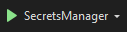

- Through the external **https://jwt.io** webpage (using the same credentials as those defined in _environment variables_).

### 4.1.1. Required JSON Web Token (JWT) components

> Knowing all required *environment variables* you can fill these claims manually and generate your own JWT tokens without using **Secrets Manager**. This approach might be helpful if you are using **OMC** Web API service only as a Web API service (**Swagger UI**), during testing its functionality from **Postman**, or when using only the **Docker Image**.

#### 4.1.1.1. Header (algorithm + type)

> {
  "alg": "HS256",
  "typ": "JWT"
}

#### 4.1.1.2. Payload (claims)

> {
  "client_id": "",
  "user_id": "",
  "user_representation": "",
  "iss": "",
  "aud": "",
  "iat": 0000000000,
  "exp": 0000000000
}

#### 4.1.1.3. Signature (secret)

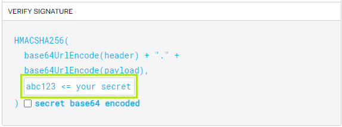

> **NOTE:** To be filled in **https://jwt.io**.

### 4.1.2. Mapping of JWT claims from environment variables

| JWT claims            | **OMC** Environment Variables                |
| --------------------- | -------------------------------------------- |
| `client_id`           | `OMC_AUTHORIZATION_JWT_ISSUER`               |
| `user_id`             | `OMC_AUTHORIZATION_JWT_USERID`               |
| `user_representation` | `OMC_AUTHORIZATION_JWT_USERNAME`             |
| `iss`                 | `OMC_AUTHORIZATION_JWT_ISSUER`               |
| `aud`                 | `OMC_AUTHORIZATION_JWT_AUDIENCE`             |
| `iat`                 | To be filled manually using current time     |
| `exp`                 | `iat` + `OMC_AUTHORIZATION_JWT_EXPIRESINMIN` |
| `secret`              | `OMC_AUTHORIZATION_JWT_SECRET`               |

> **NOTE:** "iat" and "exp" times requires Unix formats of timestamps.
The Unix timestamp can be generated using [Unix converter](https://www.unixtimestamp.com/).

### 4.1.3. Using generated JSON Web Token (JWT)

#### 4.1.3.1. Postman

> After generating the JWT token you can copy-paste it in **Postman** to authorize your HTTP requests.

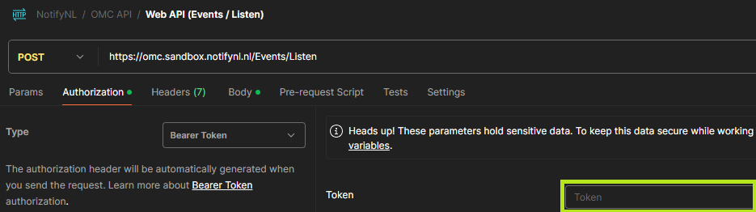

---
<h4 id="swagger-ui-authorization">4.1.3.2. Swagger UI</h4>

> If you are using **OMC** **Swagger UI** from browser (graphic interface for **OMC** Web API service) then you need to copy the generated token in the following way:

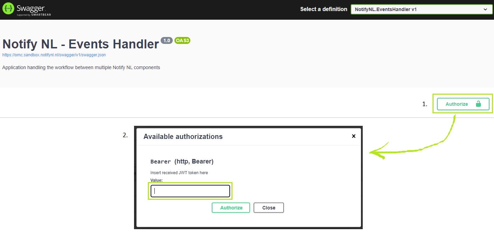

And then click "Authorize".

---
# 5. OMC Workflow


> Version of **OMC** <= 1.7.4 (using "[OMC workflow v1](#workflow_dependencies)").

<h2 id="workflow_versions">5.1. Versions of OMC workflows</h2>

The **OMC** API is using different configurations and setups to handle multiple complex business cases. Sometimes, it is even required to support multiple versions of the same external API services (which might be very different from each other).

<code>**Last update:** 03 Oct 2024</code>

<h3 id="workflow_dependencies">5.1.1. Dependencies</h3>

Here are the details which _workflows_ are using which versions of the external API services:

#### OMC workflow v1 `(default)`:
- "OpenNotificaties" v1.6.0
- "OpenZaak" v1.12.1
- "OpenKlant" v1.0.0
- "Besluiten" v1.1.0
- "Objecten" v2.3.1
- "ObjectTypen" v2.2.0
- "Contactmomenten" v1.0.0

#### OMC workflow v2:
- "OpenNotificaties" v1.6.0
- "OpenZaak" v1.12.1
- <code>new</code> "OpenKlant" v2.0.0
- "Besluiten" v1.1.0
- "Objecten" v2.3.1
- "ObjectTypen" v2.2.0
- <code>new</code> "Klantcontacten" v2.0.0

> **NOTE:** The OMC workflow can be changed using a respective _environment variable_ in the section of features.

<h2 id="scenarios">5.2. Scenarios</h2>

List of scenarios and the details how to use them with **OMC** (configurations, template personalizations, environment variables, business logic conditions, etc.).

### 5.2.1. General introduction

**OMC** "Scenarios" are specific processing workflows, set up in the code to handle certain business requirements: _what_, _when_, _how_, and _which_ to process the "initial notification" received from a subscribed channel from a _message queue_ implemented by **Open Notificaties** Web API service.

Using _environment variables_ such as "Domains", "Whitelists", "TemplateIds", and most importantly "OMC Workflow version", the user of **OMC** can have some control:
- _what_ external third-party Web API services will be used (domains)
- _when_ the specific notification will be processed (whitelists)
- _how_ the recipient will see the notification (template IDs), and
- _which_ internal implementation will be used ([OMC Workflow](#workflow_versions) version)

Implementation of new business cases, obviously(!), requires ingeretion in the code (C#) and preparing new **OMC** scenarios and the processing logic (validation, conditioning, settings...).

Currently, the following business **scenarios** are implemented:

- Opening a _case_
- Updating a _case_ status
- Closing a _case_
- Assignment of a _task_
- Receiving a _decision_
- Receiving a _message_
 
#### 5.2.1.1. Notification

Any **OMC** workflow relies on receiving the (initial) notification event from **Open Notificaties** Web API service to trigger the processing business logic.

This notification is in _JSON_ format.

Except of being awaited by **OMC** callback (`[OMC]/events/listen` endpoint) it can also be passed from outside to HTTP Requests while using **Swagger UI** or **Postman** - to test or simulate the desired **OMC** behavior. This way the initial event from **Open Notificaties** Web API service can be stubbed.

Using **Swagger UI** is recommended solution, because of its user-friendly User Interface, documentation of endpoints, parameters, remarks, JSON examples, model schemas, and validation; formatting of API responses is also better than in **Postman**.

#### 5.2.1.2. Environment variables

To work properly **OMC** always requires these mandatory _environment variables_ to be set:

> **NOTE:** If some environment variable is missing but required by one of the countless scenarios, conditions, or workflows, the **OMC** application will return a readable and user-friendly API response with the name of the missing environment variable. This is the easiest way to figure out what else is required.

</br>

`ASPNETCORE_ENVIRONMENT`

> Used by `[OMC]/events/version` endpoint and to determine which `appsettings[.xxx].json` will be used.

</br>

`OMC_AUTHORIZATION_JWT_SECRET`

`OMC_AUTHORIZATION_JWT_ISSUER`

`OMC_AUTHORIZATION_JWT_AUDIENCE`

`OMC_AUTHORIZATION_JWT_EXPIRESINMIN`

`OMC_AUTHORIZATION_JWT_USERID`

`OMC_AUTHORIZATION_JWT_USERNAME`

> Required to get access to **OMC** and be able to use it. Moreover, **Open Notificaties** Web API service will use this method to make an authorized requests while sending notification events to **OMC**.

</br>

`OMC_API_BASEURL_NOTIFYNL`

> Without this URL notifications would not work.

</br>

`OMC_FEATURES_WORKFLOW_VERSION`

> Without this setting (the version needs to be supported) the **OMC** Web API will not even run and specific implementations of underlying services will not be resolved by _Dependency Injection_ mechanism. By default you can always use `"1"` if you don't know yet which other [OMC Workflow](#workflow_versions) version you should use.

</br>

`USER_AUTHORIZATION_JWT_SECRET`

`USER_AUTHORIZATION_JWT_ISSUER`

`USER_AUTHORIZATION_JWT_AUDIENCE`

`USER_AUTHORIZATION_JWT_EXPIRESINMIN`

`USER_AUTHORIZATION_JWT_USERID`

`USER_AUTHORIZATION_JWT_USERNAME`

> **JWT authorization** is required by some versions of external API services used in certain [OMC Workflow](#workflow_versions) versions.

</br>

`USER_API_KEY_OPENKLANT`  => Required only in certain [OMC Workflow](#workflow_versions) versions

`USER_API_KEY_OBJECTEN`

`USER_API_KEY_OBJECTTYPEN`

`USER_API_KEY_NOTIFYNL`

> **API key authorization** is required by some versions of external API services used in certain [OMC Workflow](#workflow_versions) versions.

</br>

`USER_DOMAIN_OPENZAAK`

`USER_DOMAIN_OPENKLANT`

`USER_DOMAIN_BESLUITEN`

`USER_DOMAIN_OBJECTEN`

`USER_DOMAIN_OBJECTTYPEN`

`USER_DOMAIN_CONTACTMOMENTEN`

> **Domains** might have different _paths_ (e.g., `domain/something/v1/`) depends on version of external API service used in certain [OMC Workflow](#workflow_versions). For example domains for OpenKlant and ContactMomenten depends on version of **Open Klant** Web API service. Moreover, domains and paths depends on the place where your version of Web API service was deployed (domain) and the way how it is internally structured (paths).

</br>

These _environment variables_ are optional:

`SENTRY_DSN`

`SENTRY_ENVIRONMENT`

> Logging and analytics in third-party service ([Sentry.io](https://sentry.io)).

#### 5.2.1.3. Requirements

To process certain notification the specific internal criteria must be met. Usually, they are some pre-validation (analyzing the "initial notification" received from **Open Notificaties** Web API service), post-validation (to determine the scenario suited for this type of the notification), and whitelisting steps (to ensure that **OMC** should continue processing this type of notification). Sometimes, additional checks have to be performed - which depends on the specific **OMC** scenario.

#### 5.2.1.4. Template placeholders

When everything is already validated, prepared, and processed, the **Notify NL** Web API service needs to receive instruction how to format the upcoming notification. The way how to achieve this is to set up so called "template" (using **Notify NL Admin portal** webpage), define `((placeholders))` in the text (_subject_ and/or _body_) - matching to the ones defined by the specific **OMC** scenario, and then use the `ID` of this freshly generated "template" in respective _environment variable_ for **OMC**.

---

# Examples

### 5.2.2. Case Created

Notifies the respective party (e.g., a citizen or an organization) about the case being open for them. For the residents of The Netherlands the case is related to their unique personal identification number **BSN** (_Burgerservicenummer_), thanks to which their contact details and contact preferrences can be retrieved (whether they want to be notified and which notification method they prefer, e.g. by Email, SMS, etc.).

#### 5.2.2.1. Notification

Example of JSON schema:

```json
{
  "actie": "create",
  "kanaal": "zaken",
  "resource": "status",
  "kenmerken": {
    "zaaktype": "https://...",
    "bronorganisatie": "000000000",
    "vertrouwelijkheidaanduiding": "openbaar" // Or "vertrouwelijk"
  },
  "hoofdObject": "https://...",
  "resourceUrl": "https://...",
  "aanmaakdatum": "2000-01-01T10:00:00.000Z"
}
```

#### 5.2.2.2. Environment variables

Required to be set:

`USER_TEMPLATEIDS_EMAIL_ZAAKCREATE`

`USER_TEMPLATEIDS_SMS_ZAAKCREATE`

</br>

`USER_WHITELIST_ZAAKCREATE_IDS`

#### 5.2.2.3. Requirements

- The _initial notification_ has:
  -- **Action:** Create (`"create"`)
  -- **Channel:** Cases (`"zaken"`)
  -- **Resource:** Status (`"status"`)

- The _case_ has 1 _status_ (it was never updated) => this is a new _case_

- The _case type identifier_ (`"zaaktypeIdentificatie"`) has to be **whitelisted** or `"*"` wildcard used (to accept all case types) in respective whitelist _environment variable_

- The notification indication property (`"informeren"`) in _case type_ is set to _true_

- All **URI**s are valid, source data complete, and **JWT token** or **API keys** correct

The notification will be processed and sent!

> Otherwise, user will get a meaningful API feedback from **OMC** application explaining what exactly is missing.

#### 5.2.2.4. Template placeholders

Required placeholders names in the **Notify NL** template:

`((klant.voornaam))`

`((klant.voorvoegselAchternaam))`

`((klant.achternaam))`

</br>

`((zaak.identificatie))`

`((zaak.omschrijving))`

---

### 5.2.3. Case Status Updated

Notifies the respective party (e.g., a citizen or an organization) that the status of their case was updated.

#### 5.2.3.1. Notification

Example of JSON schema:

```json
{
  "actie": "create",
  "kanaal": "zaken",
  "resource": "status",
  "kenmerken": {
    "zaaktype": "https://...",
    "bronorganisatie": "000000000",
    "vertrouwelijkheidaanduiding": "openbaar" // Or "vertrouwelijk"
  },
  "hoofdObject": "https://...",
  "resourceUrl": "https://...",
  "aanmaakdatum": "2000-01-01T10:00:00.000Z"
}
```

#### 5.2.3.2. Environment variables

Required to be set:

`USER_TEMPLATEIDS_EMAIL_ZAAKUPDATE`

`USER_TEMPLATEIDS_SMS_ZAAKUPDATE`

</br>

`USER_WHITELIST_ZAAKUPDATE_IDS`

#### 5.2.3.3. Requirements

- The _initial notification_ has:
  -- **Action:** Create (`"create"`)
  -- **Channel:** Cases (`"zaken"`)
  -- **Resource:** Status (`"status"`)

- The _case_ has 2+ _statuses_ (it was updated at least once)

- The last _case status_ is not set to final (`"isEindstatus" : false`) => the _status_ of a _case_ is just updated and not yet finalized

- The _case type identifier_ (`"zaaktypeIdentificatie"`) has to be **whitelisted** or `"*"` wildcard used (to accept all case types) in respective whitelist _environment variable_

- The notification indication property (`"informeren"`) in _case type_ is set to _true_

- All **URI**s are valid, source data complete, and **JWT token** or **API keys** correct

The notification will be processed and sent!

> Otherwise, user will get a meaningful API feedback from **OMC** application explaining what exactly is missing.

#### 5.2.3.4. Template placeholders

Required placeholders names in the **Notify NL** template:

`((klant.voornaam))`

`((klant.voorvoegselAchternaam))`

`((klant.achternaam))`

</br>

`((zaak.identificatie))`

`((zaak.omschrijving))`

</br>

`((status.omschrijving))`

---

### 5.2.4. Case Closed

Notifies the respective party (e.g., a citizen or an organization) that their case was closed (e.g., resolved).

#### 5.2.4.1. Notification

Example of JSON schema:

```json
{
  "actie": "create",
  "kanaal": "zaken",
  "resource": "status",
  "kenmerken": {
    "zaaktype": "https://...",
    "bronorganisatie": "000000000",
    "vertrouwelijkheidaanduiding": "openbaar" // Or "vertrouwelijk"
  },
  "hoofdObject": "https://...",
  "resourceUrl": "https://...",
  "aanmaakdatum": "2000-01-01T10:00:00.000Z"
}
```

#### 5.2.4.2. Environment variables

Required to be set:

`USER_TEMPLATEIDS_EMAIL_ZAAKCLOSE`

`USER_TEMPLATEIDS_SMS_ZAAKCLOSE`

</br>

`USER_WHITELIST_ZAAKCLOSE_IDS`

#### 5.2.4.3. Requirements

- The _initial notification_ has:
  -- **Action:** Create (`"create"`)
  -- **Channel:** Cases (`"zaken"`)
  -- **Resource:** Status (`"status"`)

- The _case_ has 2+ _statuses_ (it was updated at least once)

- The last _case status_ is set to final (`"isEindstatus" : true`) => the _case_ is closed

- The _case type identifier_ (`"zaaktypeIdentificatie"`) has to be **whitelisted** or `"*"` wildcard used (to accept all case types) in respective whitelist _environment variable_

- The notification indication property (`"informeren"`) in _case type_ is set to _true_

- All **URI**s are valid, source data complete, and **JWT token** or **API keys** correct

The notification will be processed and sent!

> Otherwise, user will get a meaningful API feedback from **OMC** application explaining what exactly is missing.

#### 5.2.4.4. Template placeholders

Required placeholders names in the **Notify NL** template:

`((klant.voornaam))`

`((klant.voorvoegselAchternaam))`

`((klant.achternaam))`

</br>

`((zaak.identificatie))`

`((zaak.omschrijving))`

</br>

`((status.omschrijving))`

---

### 5.2.5. Task Assigned

Notifies the respective party (e.g., a citizen or an organization) that the new task was assigned to them.

#### 5.2.5.1. Notification

Example of JSON schema:

```json
{
  "actie": "create",
  "kanaal": "objecten",
  "resource": "object",
  "kenmerken": {
    "objectType": "https://..."
  },
  "hoofdObject": "https://...",
  "resourceUrl": "https://...",
  "aanmaakdatum": "2000-01-01T10:00:00.000Z"
}
```

#### 5.2.5.2. Environment variables

Required to be set:

`USER_TEMPLATEIDS_EMAIL_TASKASSIGNED`

`USER_TEMPLATEIDS_SMS_TASKASSIGNED`

</br>

`USER_WHITELIST_TASKASSIGNED_IDS`

`USER_WHITELIST_TASKOBJECTTYPE_UUID`

#### 5.2.5.3. Requirements

- The _initial notification_ has:
  -- **Action:** Create (`"create"`)
  -- **Channel:** Objects (`"objecten"`)
  -- **Resource:** Object (`"object"`)

- The **GUID** from _object type URI_ (`"objectType"`) in the _initial notification_ has to be **whitelisted** or `"*"` wildcard used (to accept all object types) in respective whitelist _environment variable_. This step will distinguish for which object type the notification is desired (e.g., tasks, messages, etc.)

- The _task_ status (`"status"`) from `record.data` nested object is set to open (`"open"`)

- The _task_ identification type (`"type"`) from `record.data.identificatie` is set to:
  -- private person (`"bsn"`)
  -- or company (`"kvk"`)

- The _case type identifier_ (`"zaaktypeIdentificatie"`) has to be **whitelisted** or `"*"` wildcard used (to accept all case types) in respective whitelist _environment variable_

- The notification indication property (`"informeren"`) in _case type_ is set to _true_

- All **URI**s are valid, source data complete, and **JWT token** or **API keys** correct

The notification will be processed and sent!

> Otherwise, user will get a meaningful API feedback from **OMC** application explaining what exactly is missing.

#### 5.2.5.4. Template placeholders

Required placeholders names in the **Notify NL** template:

`((klant.voornaam))`

`((klant.voorvoegselAchternaam))`

`((klant.achternaam))`

</br>

`((taak.verloopdatum))`

`((taak.heeft_verloopdatum))`

`((taak.record.data.title))`

</br>

`((zaak.identificatie))`

`((zaak.omschrijving))`

---

### 5.2.6. Decision Made

Notifies the respective party (e.g., a citizen or an organization) that the decision was made in their case.

#### 5.2.6.1. Notification

Example of JSON schema:

```json
{
  "actie": "create",
  "kanaal": "besluiten",
  "resource": "besluitinformatieobject",
  "kenmerken": {
    "besluittype": "https://...",
    "verantwoordelijkeOrganisatie": "000000000"
  },
  "hoofdObject": "https://...",
  "resourceUrl": "https://...",
  "aanmaakdatum": "2000-01-01T10:00:00.000Z"
}
```

#### 5.2.6.2. Environment variables

Required to be set:

`USER_TEMPLATEIDS_DECISIONMADE`

</br>

`USER_WHITELIST_DECISIONMADE_IDS`

`USER_WHITELIST_DECISIONINFOOBJECTTYPE_UUIDS`

`USER_WHITELIST_MESSAGEOBJECTTYPE_UUID`

</br>

`USER_VARIABLES_OBJECTEN_MESSAGEOBJECTTYPE_VERSION`

#### 5.2.6.3. Requirements

... To be done

#### 5.2.6.4. Template placeholders

Required placeholders names in the **Notify NL** template:

`((klant.voornaam))`

`((klant.voorvoegselAchternaam))`

`((klant.achternaam))`

</br>

`((besluit.identificatie))`

`((besluit.datum))`

`((besluit.toelichting))`

`((besluit.bestuursorgaan))`

`((besluit.ingangsdatum))`

`((besluit.vervaldatum))`

`((besluit.vervalreden))`

`((besluit.publicatiedatum))`

`((besluit.verzenddatum))`

`((besluit.uiterlijkereactiedatum))`

</br>

`((besluittype.omschrijving))`

`((besluittype.omschrijvingGeneriek))`

`((besluittype.besluitcategorie))`

`((besluittype.publicatieindicatie))`

`((besluittype.publicatietekst))`

`((besluittype.toelichting))`

</br>

`((zaak.identificatie))`

`((zaak.omschrijving))`

`((zaak.registratiedatum))`

</br>

`((zaaktype.omschrijving))`

`((zaaktype.omschrijvingGeneriek))`

---

### 5.2.7. Message Received

Notifies the respective party (e.g., a citizen or an organization) that the message with decision is available on their mailbox.

#### 5.2.7.1. Notification

Example of JSON schema:

```json
{
  "actie": "create",
  "kanaal": "objecten",
  "resource": "object",
  "kenmerken": {
    "objectType": "https://..."
  },
  "hoofdObject": "https://...",
  "resourceUrl": "https://...",
  "aanmaakdatum": "2000-01-01T10:00:00.000Z"
}
```

#### 5.2.7.2. Environment variables

Required to be set:

`USER_TEMPLATEIDS_EMAIL_MESSAGERECEIVED`

`USER_TEMPLATEIDS_SMS_MESSAGERECEIVED`

</br>

`USER_WHITELIST_MESSAGE_ALLOWED`

`USER_WHITELIST_MESSAGEOBJECTTYPE_UUID`

#### 5.2.7.3. Requirements

... To be done

#### 5.2.7.4. Template placeholders

Required placeholders names in the **Notify NL** template:

`((klant.voornaam))`

`((klant.voorvoegselAchternaam))`

`((klant.achternaam))`

</br>

`((message.onderwerp))`

`((message.handelingsperspectief))`

---

### 5.2.99. Not Implemented

A special fallback scenario which only role is to report that the provided "initial notification" or conditions are not sufficient to determine a proper **OMC** scenario - to be resolved and used for processing the business logic.

User can expect meaningful API response from **OMC**. This response will have _HTTP Status Code_ (206) that will not trigger **Open Notificaties** Web API service to retry sending the same type of "initial notification" again (which would be pointless and fail again since the **OMC** scenario or new condition are not yet implemented).

---
# 6. Errors

List of **validation** (format, requirements), **connectivity** or business logic **processing** errors that you might encounter during accessing **OMC** API endpoints.

**General errors:**

> **HTTP Status Code: 401 Unauthorized**

- Invalid JWT token:

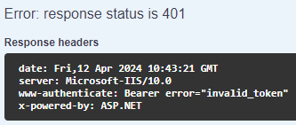

- Invalid JWT secret:

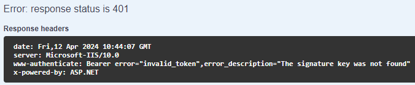

## 6.1. Events Controller

Endpoints:

- `POST` .../Events/Listen
- `GET` .../Events/Version

#### 6.1.2. Possible errors

> HTTP Status Code: 206 Partial Content

- Test notification received:

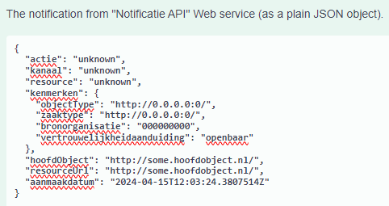

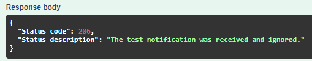

**NOTE**: Open Notificaties API is sending test notifications to ensure whether **OMC** is able to receive incoming notifications.

- Not implemented scenario:

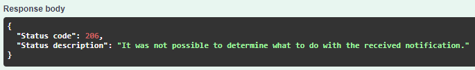

> HTTP Status Code: 422 Unprocessable Entity

- Invalid JSON payload (syntax error):

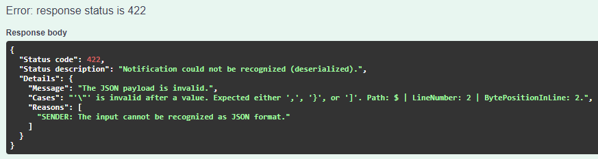

- Invalid data model (missing required fields):

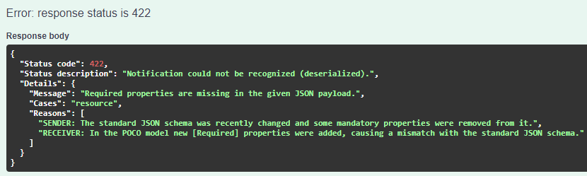

**NOTE:** Multiple propertis are supported (comma-separated).

- Invalid data model (unexpected fields):

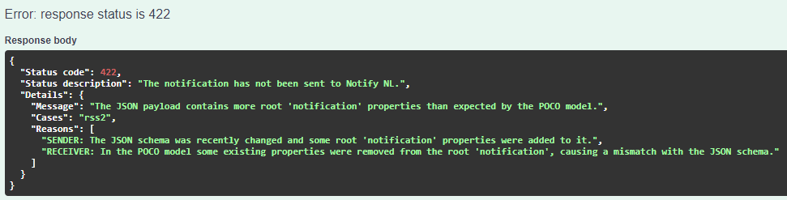

**NOTE:** Multiple propertis are supported (comma-separated).

> HTTP Status Code: 500 Internal Server Error

Any eventual (however unlike) unhandled exceptions will be reported as 500.

> HTTP Status Code: 501 Not Implemented

Other cases (than not implemented business case scenarios) may raise 501 errors.
This is however highly unlikely and might occur mainly in the development phase.

---
## 6.2. Notify Controller

Endpoints:

- `POST` .../Notify/Confirm

#### 6.2.1. Possible errors

> HTTP Status Code: 400 Bad Request

- HTTP Request error

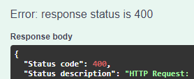

Something went wrong when calling external API services: OpenZaak, OpenKlant, contactmomenten...

You woull get the following outcome (separated by pipes):
`OMC` | `Log severity (Error / Warning / Info / Debug)` | `The first possible error message`* | `Full URL to which request was tried to be send` | `The original JSON response from the called service`** | `Notification: The initial notification`

\*  That interrupted the happy path workflow due to connectivity issues, invalid configuration values, or service being down. Unfortunately, due to complexity of the system, the variety of potential errors is quite broad.

\** **WARNING**: For some mysterious reasons, authors of the third-party software (used in **OMC-NotifyNL** workflow) decided to communicate back with the user of their API (Application **Public** Interface - through **publicly** accessible **World Wide Web** network) by using one of the local languages. You might need to translate those received _JSON Response_ messages into English.

> **NOTE**: Unfortunately, **OMC** Development Team cannot provide meaningful guidance how the external services were developed or configured.

---
## 6.3. Test Controller

### 6.3.1. Testing Notify

Endpoints:

- `GET` .../Test/Notify/HealthCheck
- `POST` .../Test/Notify/SendEmail
- `POST` .../Test/Notify/SendSms

#### 6.3.1.1. Possible errors

##### a) Common for SendEmail + SendSms:

> **HTTP Status Code: 403 Forbidden**

- Invalid base URL (**NotifyNL** API service):


- Invalid format of API key or it is missing (**NotifyNL** API service):


- Invalid API key - it was not registered for this **NotifyNL** API service:


> **HTTP Status Code: 400 Bad Request**

- Template UUID is invalid:


- Template not found:


- Missing required personalization (or the default “example” was used):


##### b) SendEmail:

- Missing required parameters:


> **HTTP Status Code: 400 Bad Request**

- Email is empty (only whitespaces):


- Email is invalid (missing @, dot, domain, etc.):


##### c) SendSms:

- Missing required parameters:


> **HTTP Status Code: 400 Bad Request**

- Phone number is empty (only whitespaces):


- Phone number contains letters or symbols:


- Phone number contains not enough digits:


- Phone number contains too many digits:


- Phone number has incorrect format (e.g., country code is not supported):


### 6.3.2. Testing Open services

Endpoints:

- `POST` .../Test/Open/ContactRegistration

#### 6.3.2.1. Possible errors

> To be finished...
